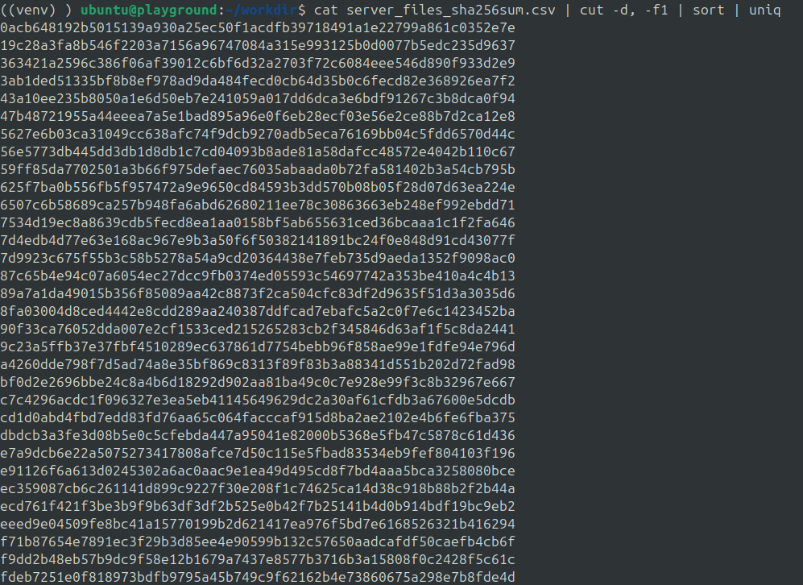
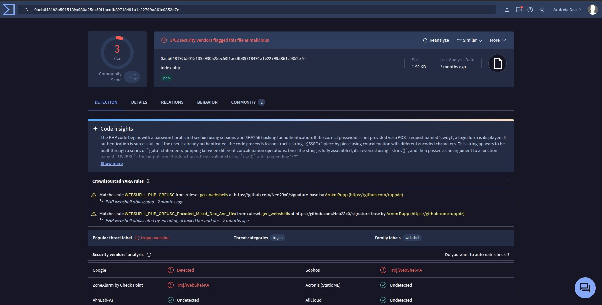
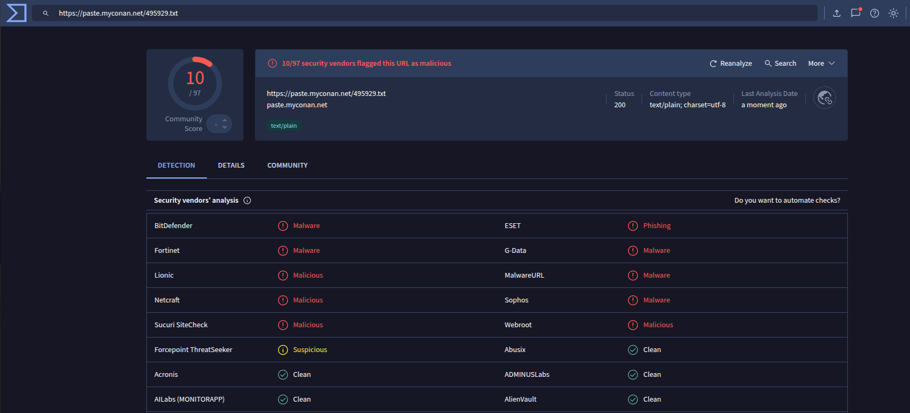
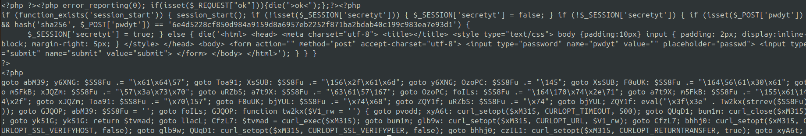

import SOCcareLogo from './assets/soccare.png';

This time, we've been requested to take a look into a compromised WordPress server.
In this blog post, you'll see how we approached the post-incident forensics and what interesting artifacts we've uncovered.

For this incident, we were provided with a disk snapshot of a compromised Wordpress server stored as a `qcow2` image.
Extracting forensic data from a snapshot is a great task for using [Dissect](https://docs.dissect.tools/en/stable/index.html) because it allows us to analyze targets without mounting or booting them. Dissect is actually a collection of modular tools that can be combined or extended to retrieve common information from the targets (users, cron jobs, services, history, filesystem entries).

<!-- truncate -->

In this investigation, we mostly used the following commands:
```shell-session
$ target-info
$ target-query -f users,cronjobs,services
$ target-query -f walkfs
$ target-fs
$ target-shell
```

We started by gathering some initial data from the system using `target-info`:

```shell-session
$ target-info wordpress.qcow2

Disks
- <Disk type="QCow2Container" size="68719476736">

Volumes
- <Volume name="part_06f00000" size="68603067392" fs="ExtFilesystem">
- <Volume name="part_00100000" size="4193792" fs="NoneType">
- <Volume name="part_00500000" size="111148544" fs="FatFilesystem">

Hostname       : wordpress
Domain         : None
Ips            : <redacted>
Os family      : linux
Os version     : Ubuntu 20.04.6 LTS (Focal Fossa)
Architecture   : x86_64-linux
Language       :
Timezone       : UTC
Install date   : 2022-06-10T09:22:32.214000+00:00
Last activity  : 2025-04-15T07:23:01.955681+00:00
```

One important piece of information from the output is the **`Last activity`** date - **`2025-04-15T07:23:01`**.
We used this timestamp as a starting point to check filesystem changes such as newly created or modified files.

To extract metadata information about the filesystem entries, we leveraged `target-query -f walkfs`.
This approach will help us to be able to easily manipulate data later with `awk`/`cut`.

```shell-session
$ target-query -q wordpress.qcow2 -f walkfs | rdump -m csv > filesystem.csv
```
The metadata saved by Dissect for each filesystem entry includes, among others, fields like access time (`atime`), modification time (`mtime`), change time (`ctime`), birth time (`btime`), permissions (`mode`), `path`, `uid` and `gid`:
```shell-session
$ target-query -q wordpress.qcow2 -f walkfs --limit 2 | rdump -l
RecordDescriptor("filesystem/entry", [
    ("string", "hostname"),
    ("string", "domain"),
    ("datetime", "atime"),
    ("datetime", "mtime"),
    ("datetime", "ctime"),
    ("datetime", "btime"),
    ("varint", "ino"),
    ("path", "path"),
    ("filesize", "size"),
    ("uint32", "mode"),
    ("uint32", "uid"),
    ("uint32", "gid"),
    ("string[]", "fstypes"),
    ("string", "_source"),
    ("string", "_classification"),
    ("datetime", "_generated"),
    ("varint", "_version"),
])
```

To narrow down the files created on the last activity day, we filtered the raw data as following:
```shell-session
$ awk -F, '$6 ~ /^2025-04-15/' filesystem_entries.csv | cut -d, -f3,4,5,6,8,9,10 > btime_2025-04-15.csv
```

If we look into `btime_2025-04-15.csv`, we'll notice some files that are usually created daily such as logs, backups or caches.
Apart from that, there are a suspicious amount of files created in the static content of the WordPress compromised domain:

```shell-session
$ cat btime_2025-04-15.csv | sort -k4 | cut -d, -f5
/srv/www/wp_domain/wp-content/defaults.php
/srv/www/wp_domain/wp-content/item.php
/srv/www/wp_domain/wp-content/mah.php
/srv/www/wp_domain/wp-content/plugins/code-snippets/dist/editor-themes/index.php
/srv/www/wp_domain/wp-content/plugins/code-snippets/js/manage/click.php
/srv/www/wp_domain/wp-content/plugins/gutenberg/build-module/interactivity-router/index.php
/srv/www/wp_domain/wp-content/plugins/gutenberg/build/customize-widgets/mah.php
/srv/www/wp_domain/wp-content/plugins/gutenberg/build/edit-site/plugins.php
/srv/www/wp_domain/wp-content/themes/twentynineteen/sass/typography/index.php
/srv/www/wp_domain/wp-content/themes/twentyseventeen/template-parts/footer/index.php
/srv/www/wp_domain/wp-content/wp-log1n.php
/srv/www/wp_domain/wp-content/plugins/gutenberg/build/react-refresh-entry/index.php
/srv/www/wp_domain/wp-content/plugins/add-search-to-menu/public/css/index.php
/srv/www/wp_domain/wp-content/plugins/code-snippets/php/admin-menus/wp-log1n.php
/srv/www/wp_domain/wp-content/plugins/file-manager-advanced/application/library/index.php
/srv/www/wp_domain/wp-content/plugins/file-manager-advanced/application/pages/index.php
/srv/www/wp_domain/wp-content/plugins/folders/assets/images/index.php
/srv/www/wp_domain/wp-content/plugins/folders/templates/admin/networks.php
/srv/www/wp_domain/wp-content/plugins/gutenberg/build/block-editor/index.php
/srv/www/wp_domain/wp-content/plugins/gutenberg/build/block-serialization-default-parser/index.php
/srv/www/wp_domain/wp-content/plugins/gutenberg/build/block-serialization-spec-parser/index.php
/srv/www/wp_domain/wp-content/plugins/gutenberg/build/blocks/index.php
/srv/www/wp_domain/wp-content/plugins/gutenberg/build/core-data/index.php
/srv/www/wp_domain/wp-content/plugins/gutenberg/build/dom/index.php
/srv/www/wp_domain/wp-content/plugins/gutenberg/build/edit-post/index.php
/srv/www/wp_domain/wp-content/plugins/gutenberg/build/element/index.php
/srv/www/wp_domain/wp-content/plugins/gutenberg/build/format-library/index.php
/srv/www/wp_domain/wp-content/plugins/gutenberg/build/hooks/index.php
/srv/www/wp_domain/wp-content/plugins/gutenberg/build/i18n/index.php
/srv/www/wp_domain/wp-content/plugins/gutenberg/build/router/index.php
/srv/www/wp_domain/wp-content/plugins/translatepress-multilingual/assets/images/index.php
/srv/www/wp_domain/wp-content/plugins/translatepress-multilingual/assets/lib/networks.php
/srv/www/wp_domain/wp-content/plugins/translatepress-multilingual/includes/mtapi/index.php
/srv/www/wp_domain/wp-content/plugins/wp-file-manager/lib/img/index.php
/srv/www/wp_domain/wp-content/themes/twentyeleven/images/headers/index.php
/srv/www/wp_domain/wp-content/themes/twentytwentyone/template-parts/header/index.php
```

It looks like we've already stumbled upon some suspicious files such as `wp-log1n.php` or `mah.php`, but let's not get ahead of ourselves.

When a WordPress server is infected, the attackers are typically dropping malicious files across several directories (`plugins`, `themes`, `wp-content`) to plant multiple backdoors. So, let's not get intimidated by the numbers of suspicious scripts and see how many unique ones we are actually dealing with.

Using file hashing, we can quickly group duplicates and we can also check them against known external malware databases such as [VirusTotal](https://www.virustotal.com/) to confirm if they are suspicious indeed.

```shell-session
$ cat btime_2025-04-15.csv | sort -k4 | cut -d, -f5 | grep "srv/www/wp_domain" | xargs -I{} sh -c 'target-fs -q wordpress.qcow2 cat "{}" | sha256sum' > server_files_sha256sum.csv
```



By submitting these hashes to VirusTotal reveals that all of them are some kind of PHP backdoor, shellcode or trojan:



Attempting to take a peek through each of them, we made the following observations:
- the code is obfuscated PHP - it contains random variable names and `goto` chains.
- many files have similar content, but the `goto` tags and the random variable names are leading to different hashes, despite the content being quite similar.

Upon further inspection, we found some low hanging fruits - in the following files, domains and suspicious URLs appear in plain text:
```shell-session
/srv/www/wp_domain/wp-content/mah.php
/srv/www/wp_domain/wp-content/plugins/gutenberg/build/block-serialization-default-parser/index.php
/srv/www/wp_domain/wp-content/plugins/gutenberg/build/hooks/index.php
/srv/www/wp_domain/wp-content/plugins/gutenberg/build/i18n/index.php
/srv/www/wp_domain/wp-content/plugins/translatepress-multilingual/assets/images/index.php
/srv/www/wp_domain/wp-content/themes/twentytwentyone/template-parts/header/index.php
```

These scripts contain URLs pointing to external servers, likely used to download additional payloads or send stolen data:
```
hxxps://user-images[.]githubusercontent[.]com/143735067/264713238-ae810af4-c98d-421f-bbb3-1ddcc58f952a[.]jpg
hxxps://paste[.]myconan[.]net/495929[.]txt
hxxps://web[.]archive[.]org/web/20040114105613im_/
```

We checked these URLs on VirusTotal as well:



Unfortunately, not all the scripts are written in plain text.
```shell-session
/srv/www/wp_domain/wp-content/defaults.php
/srv/www/wp_domain/wp-content/item.php
/srv/www/wp_domain/wp-content/plugins/code-snippets/dist/editor-themes/index.php
/srv/www/wp_domain/wp-content/plugins/gutenberg/build-module/interactivity-router/index.php
/srv/www/wp_domain/wp-content/plugins/gutenberg/build/edit-site/plugins.php
/srv/www/wp_domain/wp-content/wp-log1n.php
/srv/www/wp_domain/wp-content/plugins/add-search-to-menu/public/css/index.php
```

Some are heavily obfuscated:


Investigating one such script revealed the following behavior:
- Initially, it tests if `_SESSION['secretyt']` is set.
- If the session is not set, the script expectes a POST request that sets the query param `pwdyt` to a specific value.
- If the query param is not set, the script renders an HTML form with the input `pwdyt` waiting for the correct password.
- The PHP script is opening a `curl` session on a specific (malicious) external URL

To retrieve the URLs from these files, we needed to deobfuscate them with the following technique:
1. Decode the ASCII characters from hex, octal or decimal to the human readable character.
2. Follow along the chain of `goto`s that lead to the reversed final URL.

Again, we found URLs to external servers, likely used to download additional payloads or shellcodes:
```
hxxps://dama01[.]top/
hxxps://dama01[.]top/dama/old/7[.]txt
hxxps://dama10[.]top/dama/new/139[.]txt
hxxps:/raw[.]githubusercontent[.]com/brandonokk/janfiles/refs/heads/main/dama/old/142[.]txt
```

It's clear that this wordpress instance is infected with multiple backdoors that allow the attackers to download new payloads and execute malicious code using `eval()`.

What's not clear is how the attack started in the first place. To actually understand that, we have to dig deeper than the day of the attack. We leveraged dissect once more - this time we are using `target-shell` to simulate a read-only shell where we can investigate freely to check for other suspicious files.

```shell-session
$ target-shell wordpress.qcow2

wordpress: ls -l /srv/www/wp_domain/
total 31
-rw-r--r-- 1000 1000        532 2023-03-04T12:05:05.387214+00:00 .htaccess
drwxr-xr-x 1000 1000       4096 2023-01-24T11:17:06.426740+00:00 .tmb
-rw-r--r-- 1000 1000     177999 2023-01-24T11:17:06.426740+00:00 1.php
drwxr-xr-x 1000 1000       4096 2023-01-24T11:17:06.426740+00:00 ALFA_DATA
-rw-r--r-- 1000 1000        852 2023-01-24T11:17:06.426740+00:00 header.php
-rw-r--r-- 1000 1000        405 2023-01-24T11:17:04.314693+00:00 index.php
-rw-r--r-- 1000 1000        852 2023-01-24T11:17:06.426740+00:00 indexx.php
-rw-r--r-- 1000 1000      17481 2023-01-24T11:17:06.426740+00:00 jh.php
-rw-r--r-- 1000 1000      19915 2024-10-10T18:29:36.287834+00:00 license.txt
-rw-r--r-- 1000 1000      24880 2023-01-24T11:17:06.426740+00:00 licenza.html
-rw-r--r-- 1000 1000        852 2023-01-24T11:17:06.426740+00:00 news.php
-rw-r--r-- 1000 1000       1179 2023-01-24T11:17:06.426740+00:00 options.php
-rw-r--r-- 1000 1000       7409 2024-10-10T18:29:32.591767+00:00 readme.html
-rw-r--r-- 1000 1000     196918 2023-01-24T11:17:06.426740+00:00 test.php
-rw-r--r-- 1000 1000       7387 2024-10-10T18:29:36.287834+00:00 wp-activate.php
drwxr-xr-x 1000 1000       4096 2024-10-10T18:29:36.287834+00:00 wp-admin
-rw-r--r-- 1000 1000        351 2023-01-24T11:17:04.314693+00:00 wp-blog-header.php
-rw-r--r-- 1000 1000       2323 2024-10-10T18:29:36.287834+00:00 wp-comments-post.php
-rw-r--r-- 1000 1000       3033 2024-10-10T18:29:32.591767+00:00 wp-config-sample.php
-rw-r--r-- 1000 1000       3735 2024-11-05T08:26:48.203246+00:00 wp-config.php
dr-xr-xr-x   33   33       4096 2025-04-15T06:45:08.559303+00:00 wp-content
-rw-r--r-- 1000 1000       5638 2024-10-10T18:29:32.567766+00:00 wp-cron.php
drwxr-xr-x 1000 1000      12288 2024-10-10T18:29:36.395835+00:00 wp-includes
-rw-r--r-- 1000 1000       2502 2024-10-10T18:29:36.287834+00:00 wp-links-opml.php
-rw-r--r-- 1000 1000       3937 2024-10-10T18:29:34.339798+00:00 wp-load.php
-rw-r--r-- 1000 1000      51238 2024-10-10T18:29:36.287834+00:00 wp-login.php
-rw-r--r-- 1000 1000       8525 2024-10-10T18:29:32.591767+00:00 wp-mail.php
-rw-r--r-- 1000 1000      28774 2024-10-10T18:29:32.591767+00:00 wp-settings.php
-rw-r--r-- 1000 1000      34385 2024-10-10T18:29:32.567766+00:00 wp-signup.php
-rw-r--r-- 1000 1000       4885 2024-10-10T18:29:36.287834+00:00 wp-trackback.php
-rw-r--r-- 1000 1000       3246 2024-10-10T18:29:34.339798+00:00 xmlrpc.php
```

We noticed that there are many more suspicious files such as `1.php`, `jh.php`, `indexx.php` and so on.
The one that really picked our interest was `ALFA_DATA`. This is a signature commonly associated with the Alfa Team shell, a PHP web shell used by attackers to gain unauthorized access and control over compromised web servers.

Unfortunately, investigating the birth dates of these files revealed that the system was compromised a while ago:
```shell-session
$ tree ALFA_DATA/
/srv/www/wp_domain/ALFA_DATA/alfacgiapi:
.htaccess
bash.alfa
perl.alfa
py.alfa

$ stat ALFA_DATA/alfacgiapi/perl.alfa
  File: /srv/www/wp_domain/ALFA_DATA/alfacgiapi/perl.alfa
  Size: 542       Blocks: 8    IO Block: 4096     regular file
Device: ?     Inode: 286224      Links: 1
Access: (0o644/-rw-r--r--)  Uid: ( 1000 )   Gid: ( 1000 )
Access: 2023-03-17T08:22:40.829812+00:00
Modify: 2023-01-24T11:17:06.426740+00:00
Change: 2024-10-11T08:20:58.476943+00:00
 Birth: 2023-01-24T11:17:06.426740+00:00
```

There are no Apache logs retained from that period of time making it impossible to identify the attack vector that lead to the first infection.

### SOCcare

The SOCcare project is co-funded by the European Union, alongside our collaborators,
NRD Cyber Security and RevelSI, and supported by the
European Cybersecurity Competence Centre (ECCC) Centre (ECCC) under Grant Agreement No. 101145843.
Views and opinions expressed are however those of the author(s) only and do not necessarily
reflect those of the European Union or the European Cybersecurity Competence Centre.
Neither the European Union nor the European Cybersecurity Competence Centre can be held responsible for them.


