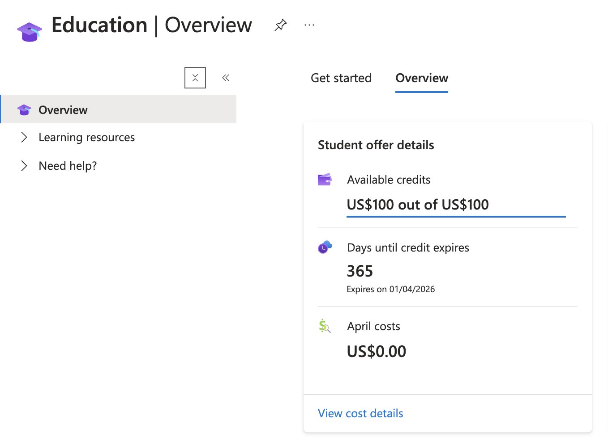

## **Creating an Azure for Students Account**

1. **Access the Azure for Students Offer**
   - Step 1: Go to [aka.ms/azureforstudents](https://aka.ms/azureforstudents).
   - Step 2: Click on "Start Free" to begin the registration process.
   - Step 3: Sign in with your school email address - e.g. `mihai.popescu@stud.acs.upb.ro`.

2. **Academic Verification**
   - Step 4: Enter your name as per the school records - e.g. `Mihai-Vlad POPESCU`.
   - Step 5: Select your school's country and enter your school's name - `Romania` and `Facultatea de Automatică și Calculatoare (Bucharest)`.
   - Step 6: Enter your date of birth as per the school records - e.g `01.01.2000`.
   - Step 7: Enter your school email address - e.g. `mihai.popescu@stud.acs.upb.ro`.

3. **Profile Information**
   - Step 8: Fill in your profile information including country/region, first name, last name, email address, phone number, and address.
   - Step 9: Enable multi-factor authentication.

4. **Microsoft Authenticator Configuration**
   - Step 9: Download and install the `Microsoft Authenticator` app on your mobile device.
   - Step 10: Open the app and scan the QR code provided on the Azure portal.
   - Step 11: If you can't scan the QR code, manually enter the code and URL provided.

5. **Verification and Final Steps**
   - Step 12: Check your school email for any verification notifications from Microsoft Azure.
   - Step 13: Verify your account using the Microsoft Authenticator app.

6. **Accessing Azure Credits**
   - Step 14: Once verified, you should see your available Azure credits and free services.

