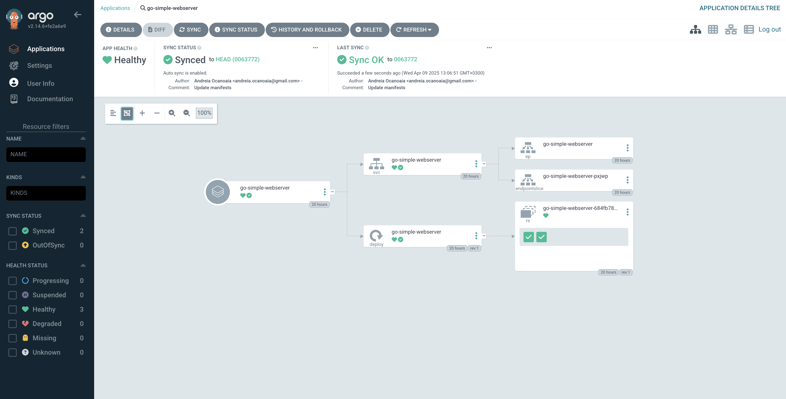

## Argo CD

Argo CD is a declarative, GitOps-based continuous delivery tool for Kubernetes. It enables you to deploy applications by syncing the desired state defined in Git repositories with your actual cluster.

:::info
`argocd` is already installed in on your VM by the `lab_ci_cd.sh` setup script.
:::

### Creating a Kubernetes cluster

As in the previous laboratories, we will create a cluster on the lab machine, using the `kind create cluster` command:

```shell-session
student@lab-kubernetes:~$ kind create cluster
Creating cluster "kind" ...
 ✓ Ensuring node image (kindest/node:v1.23.4) 🖼
 ✓ Preparing nodes 📦
 ✓ Writing configuration 📜
 ✓ Starting control-plane 🕹️
 ✓ Installing CNI 🔌
 ✓ Installing StorageClass 💾
Set kubectl context to "kind-kind"
You can now use your cluster with:

kubectl cluster-info --context kind-kind

Thanks for using kind! 😊
```

:::note
It is recommended that you use port-forwarding instead of X11 forwarding to interact with the UI.
:::

### Creating resources for Argo CD in k8s

To enable and create the resources required by Argo CD in your Kubernetes cluster, run the following commands:

```shell-session
student@cc-lab:~$ kubectl create namespace argocd
student@cc-lab:~$ kubectl apply -n argocd -f https://raw.githubusercontent.com/argoproj/argo-cd/stable/manifests/install.yaml
student@cc-lab:~$ kubectl get all -n argocd
NAME                                                   READY   STATUS    RESTARTS   AGE
pod/argocd-application-controller-0                    1/1     Running   0          25h

[...]

NAME                                             READY   AGE
statefulset.apps/argocd-application-controller   1/1     25h
```

### Creating an Argo CD project in k8s

To deploy your application using Argo CD, create an `application.yaml` file that defines an Argo CD Application resource.
This YAML configuration tells Argo CD where to find your application's manifests (in your git repository - `./manifests`) and where to deploy them inside your Kubernetes cluster (in the `default` namespace):

```shell-session
student@cc-lab:~/ci_cd_lab$ cat application.yaml
apiVersion: argoproj.io/v1alpha1
kind: Application
metadata:
  name: go-simple-webserver
  namespace: argocd
spec:
  project: default
  source:
    repoURL: https://github.com/<todo-add-your-github-username>/ci_cd_lab.git
    targetRevision: HEAD
    path: manifests
  destination:
    server: https://kubernetes.default.svc
    namespace: default
```

Apply the Argo manifest `application.yaml` to link the repository to an Argo project in K8s:

```shell-session
student@cc-lab:~$ kubectl apply -f application.yaml
```

Check the resources created in the `argocd` namespace:

```shell-session
student@cc-lab:~$ kubectl get application go-simple-webserver -n argocd
NAME                  SYNC STATUS   HEALTH STATUS
go-simple-webserver   Unknown        Healthy
```

Note: There are no deployments of your webserver yet, because the Argo project is not synced with the cluster.

:::info
Argo CD provides a dashboard to interact with the CI/CD pipeline on `localhost:8080`.

There are two options for connecting to the Argo CD user interface: SSH tunneling or Chrome Remote Desktop.

[Follow this tutorial](https://cloud-courses.upb.ro/docs/basic/working_with_openstack/#permanent-ssh-configurations) to configure the SSH service to bind and forward the `8080` port to your machine:

```shell-session
kubectl port-forward svc/argocd-server -n argocd 8080:443
```

```shell-session
ssh -J fep -L 8080:127.0.0.1:8080 -i ~/.ssh/id_fep  student@10.9.X.Y
```

Run the following command to get the password from the admin account and login into the dashboard:
```shell-session
kubectl get secret argocd-initial-admin-secret -n argocd   -o jsonpath="{.data.password}" | base64 -d && echo
```
:::

:::info
An alternative to SSH tunneling or X11 forwarding is Chrome Remote Desktop, which allows you to connect to the graphical inteface of your VM.

If you want to use this method, follow the steps from [here](https://cloud-courses.upb.ro/docs/basic/crd).
:::

### Login to Argo CD

To interact using the `argocd` CLI or to login to the Argo dashboard, you need to get the initial password for the `admin` user:

```shell-session
student@cc-lab:~$ kubectl get secret argocd-initial-admin-secret -n argocd -o jsonpath="{.data.password}" | base64 -d && echo
```

To login to the Argo CD CLI, use the following command:

```shell-session
student@cc-lab:~$ argocd login localhost:8080 --username admin --password <password-above> --insecure
```

For the Argo dashboard, open your browser and navigate to `http://localhost:8080`. Use the same credentials as above.

### Creating an Argo CD deployment

The manifest below defines a Kubernetes Deployment for the `go-simple-webserver` application.

It runs two replicas of a container using the image hosted on GitHub Container Registry, exposing port 8080 for incoming traffic.

```shell-session
student@cc-lab:~/ci_cd_lab$ cat manifests/deployment.yaml
apiVersion: apps/v1
kind: Deployment
metadata:
  name: go-simple-webserver
  labels:
    app: go-simple-webserver
spec:
  replicas: 2
  selector:
    matchLabels:
      app: go-simple-webserver
  template:
    metadata:
      labels:
        app: go-simple-webserver
    spec:
      containers:
        - name: webserver
          image: ghcr.io/<todo-add-your-github-username>/ci_cd_lab:latest
          ports:
            - containerPort: 8080
```

Push the `manifests/deployment.yaml` in your repository and sync the Argo project in k8s to create a deployment:

```shell-session
student@cc-lab:~/ci_cd_lab$ git add manifests/deployment.yaml
student@cc-lab:~/ci_cd_lab$ git commit -m "Add deployment for go-simple-webserver"
student@cc-lab:~/ci_cd_lab$ git push
```

Check the resources that already exist in the `default` namespace:
```shell-session
student@cc-lab:~$ kubectl get all -n default
```

Sync the Argo project to create the deployment:
```shell-session
student@cc-lab:~$ argocd app sync go-simple-webserver
```

Check the new resources created in the `default` namespace:
```shell-session
student@cc-lab:~$ kubectl get all -n default
```

You can also check the Argo CD dashboard to see the new deployment created:


### Exercise - Enable Argo CD auto-sync

Modify the `application.yaml` manifest to enable Argo CD's auto-sync feature, so that after changes are made to the `manifests` directory, it will automatically trigger a deployment.

Don't forget to re-apply the modified manifest using `kubectl`.

Check the [official Argo CD documentation](https://argo-cd.readthedocs.io/en/stable/user-guide/auto_sync/) for the correct syntax.

### Exercise - Change the number of replicas and re-sync the project

Update the number of replicas in `manifests/deployment.yaml` from `2` to `10`, push the changes to your repo and monitor the changes to check if the auto-sync feature works as expected.

:::tip
Argo CD polls the repository [every 3 minutes by default](https://argo-cd.readthedocs.io/en/stable/user-guide/auto_sync/#automated-sync-semantics) to check if there are any changes to `manifests`.

You can force a hard refresh by clicking the Refresh button in the Argo CD dashboard or by running the following command:
```shell-session
student@cc-lab:~$ argocd app get go-simple-webserver --refresh
```
:::
