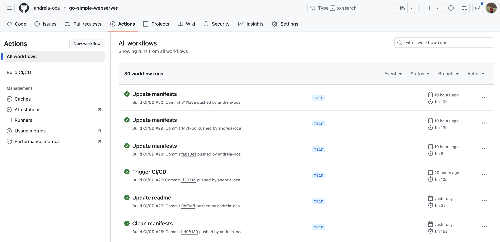
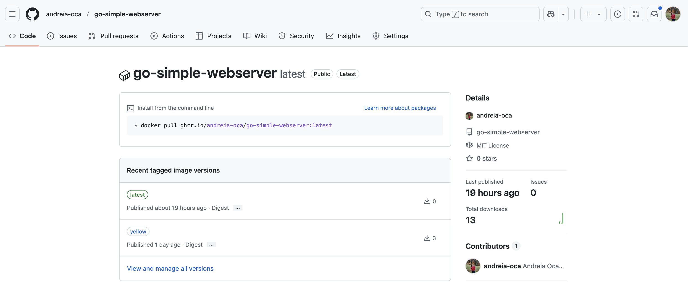

## GitHub Actions Workflows

GitHub Actions allows you to automate tasks within your GitHub repositories in CI/CD pipelines by writing a `yaml` configuration file called `Workflow`.

A workflow is defined by a set of jobs that are triggered by specific events, like a push to the `main` branch or a manual trigger.

:::info
You will be working starting from this repository: https://github.com/andreia-oca/ci_cd_lab.

Fork it into your GitHub account and clone it in the Openstack VM.
:::

:::info
There are two methods of cloning the repo from GitHub, choose **one** of them:

**(a) Git over HTTPS**:

In this case, you will need to create a Personal Access Token for being able to push changes.
Follow the instructions from [here](https://docs.github.com/en/authentication/keeping-your-account-and-data-secure/managing-your-personal-access-tokens#creating-a-personal-access-token-classic).

Run the commands below to clone the repository in your Openstack VM:

```shell-session
student@cc-lab:~$ git clone https://github.com/<your-gitub-username>/ci_cd_lab.git
student@cc-lab:~$ cd ci_cd_lab/
```

**(b) Git over SSH**:

You will need to create a SSH keypair in your lab VM and configure it into your GitHub account.

Follow the instructions from [here](https://docs.github.com/en/authentication/connecting-to-github-with-ssh/adding-a-new-ssh-key-to-your-github-account?platform=linux&tool=webui).

Run the commands below to clone the repository in your Openstack VM:

```shell-session
student@cc-lab:~$ git clone git@github.com:<your-github-username>/ci_cd_lab.git
student@cc-lab:~$ cd ci_cd_lab/
```
:::

Inspect the `.github/workflows/deploy.yaml`:

```yaml
# .github/workflows/deploy.yaml
name: Build CI/CD

# Trigger the workflow on a commit push to the `main` branch
on:
  # Trigger the workflow on a commit push to the `main` branch
  push:
    branches:
      - main

jobs:
  # Job to compile the application
  compile:
    # Specify the Os for the runner (container)
    runs-on: ubuntu-latest  # Use the latest Ubuntu runner

    steps:
      # Step 1: Checkout the repository code into the runner
      - name: Checkout code
        uses: actions/checkout@v4

      # Step 2: Set up Go environment with version 1.22
      - name: Set up Go
        uses: actions/setup-go@v5
        with:
          go-version: '1.22'

      # Step 3: Download Go module dependencies
      - name: Install dependencies
        run: go mod download

      # Step 4: Compile the Go application into a binary named 'myapp'
      - name: Compile binary
        run: go build -o myapp
```

### Exercise - Create a new job to enable automated tests

In this exercise, you will create a new job called `test` that runs Go tests **before** the compile job:

Your workflow should:

1. Run tests first by executing the command `go test ./...`.
2. If the `test` job is successful, proceed to the `compile` job to build the binary.

Note: To control the execution order and add conditions between jobs, GitHub Actions provides the `needs` and `if` directives.
Refer to the [official documentation](https://docs.github.com/en/actions/writing-workflows/choosing-what-your-workflow-does/using-jobs-in-a-workflow) to learn how to use them.

Complete and add the following snippet to `.github/workflows/deploy.yaml`:

```yaml
jobs:

[...]

  test:
    runs-on: ubuntu-latest
    steps:
      - name: Checkout code
        uses: actions/checkout@v4

      - name: Set up Go
        uses: actions/setup-go@v5
        with:
          go-version: '1.22'

      - name: Install dependencies
        run: go mod download

      # TODO 01 - Add a step to run tests
      - name: Run tests
        run: #TODO

  compile:
    [...]
    # TODO 02 - Make sure that the `test` job is run before `compile`
```

To take effect, commit the changes from the `deploy.yaml` file and push them to your forked repository:

```shell-session
student@cc-lab:~$ git status
student@cc-lab:~$ git add .github/workflows/deploy.yaml
student@cc-lab:~$ git commit -m "Add test step to workflow"
student@cc-lab:~$ git push
```

Check the `Actions` tab from your GitHub repository page to monitor the workflow's output. It should look similar to this:




### Exercise - Create a new job to build a docker image

In this exercise, you will create a new job called `build` that packages your compiled Go server into a Docker image and pushes it to GitHub Container Registry (GHCR).

```yaml
  build:
    # Specify the OS for the runner
    runs-on: ubuntu-latest

    # Grant write permissions to access repository contents and GitHub Container Registry
    permissions:
      contents: write
      packages: write

    # Run this job only after the 'compile' job completes successfully
    needs: compile
    if: success()

    steps:
      # Step 1: Checkout the repository code
      - name: Checkout code
        uses: actions/checkout@v4

      # Step 2: Set up the Go environment (Go 1.22)
      - name: Set up Go
        uses: actions/setup-go@v5
        with:
          go-version: '1.22'

      # Step 3: Log in to GitHub Container Registry (GHCR) using GitHub Actions token
      - name: Log in to GHCR
        uses: docker/login-action@v3
        with:
          registry: ghcr.io
          username: ${{ github.actor }}             # GitHub username (actor triggering the workflow)
          password: ${{ secrets.GITHUB_TOKEN }}     # Automatically provided GitHub token

      # Step 4: Build the Docker image and tag it with the repository name and 'latest'
      - name: Build Docker image
        run: docker build -t ghcr.io/${{ github.repository }}:latest .

      # Step 5: Push the Docker image to GitHub Container Registry
      - name: Push Docker image
        run: docker push ghcr.io/${{ github.repository }}:latest
```

:::info
If your name contains uppers case letters you need to change the image name to lowercase. The easiest fix is to hardcode your username and repository instead of `${{ github.repository }}`.

For example, if your name is `JohnDoe`, you can use `ghcr.io/johndoe/ci_cd_lab:latest`.
:::

Refer to the [documentation here](https://docs.github.com/en/packages/working-with-a-github-packages-registry/working-with-the-container-registry) to better understand how to interact with GHCR.

To take effect, commit the changes from the `deploy.yaml` file and push them to your forked repository:

```shell-session
student@cc-lab:~$ git status
student@cc-lab:~$ git add .github/workflows/deploy.yaml
student@cc-lab:~$ git commit -m "Add build step to workflow"
student@cc-lab:~$ git push
```

Check the `Actions` tab from your GitHub repository page to monitor the workflow's output.

Check the `Packages` page from Github to see the built Docker image there. `Packages` should be found at `https://github.com/<your-github-username>?tab=packages`.

It should look similar to this:


