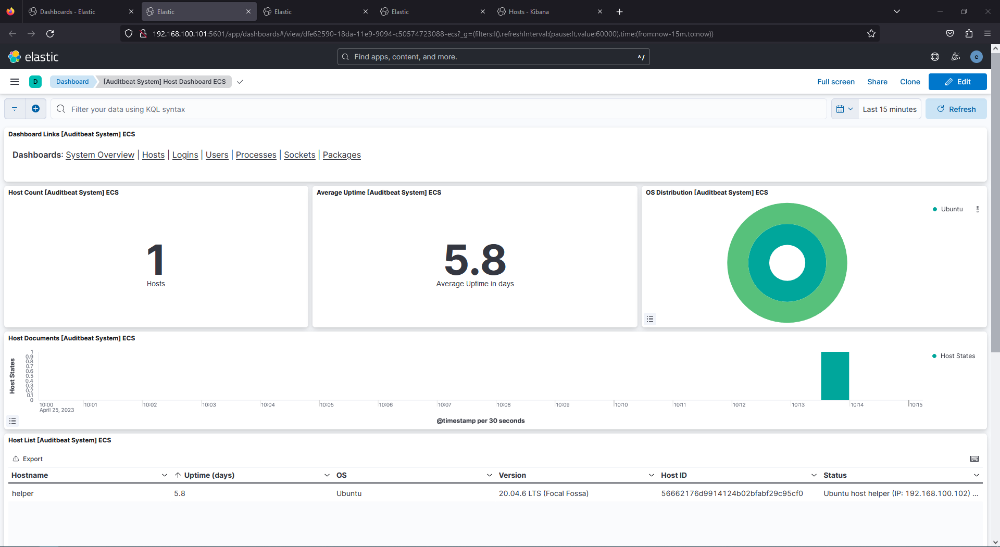
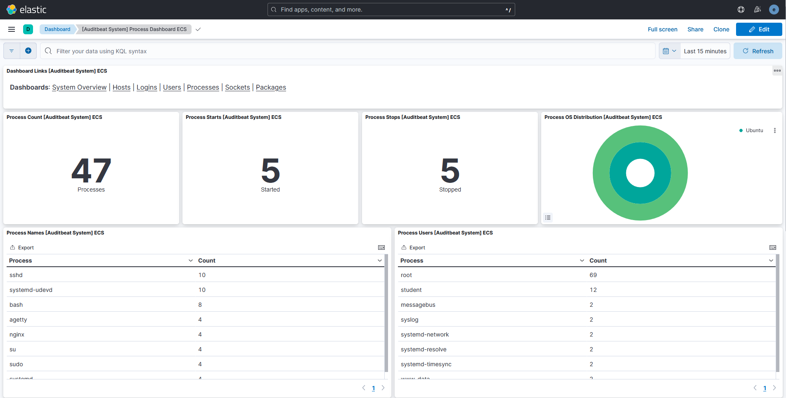
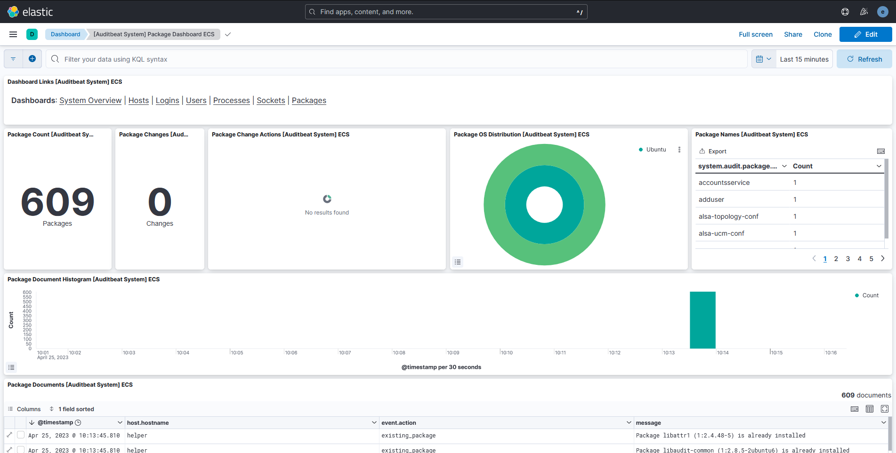

## Monitoring hosts using Auditbeat

### Installing and configuring auditbeat

Auditbeat installation is identical to the other Beats.

- Download the DEB package and signature
    
    ```shell-session
    student@helper:~$ wget https://artifacts.elastic.co/downloads/beats/auditbeat/auditbeat-8.7.0-amd64.deb
    student@helper:~$ wget https://artifacts.elastic.co/downloads/beats/auditbeat/auditbeat-8.7.0-amd64.deb.sha512
    ```
    
- Check the signature is ok
    
    ```shell-session
    student@helper:~$ sha512sum -c auditbeat-8.7.0-amd64.deb.sha512
    auditbeat-8.7.0-amd64.deb: OK
    ```
    
- Install using `dpkg`
    
    ```shell-session
    student@helper:~$ sudo dpkg -i auditbeat-8.7.0-amd64.deb
    Selecting previously unselected package auditbeat.
    (Reading database ... 41359 files and directories currently installed.)
    Preparing to unpack auditbeat-8.7.0-amd64.deb ...
    Unpacking auditbeat (8.7.0) ...
    Setting up auditbeat (8.7.0) ...
    Processing triggers for systemd (245.4-4ubuntu3.21) ...
    ```
    

The default configuration is in `/etc/auditbeat/auditbeat/yml`. For this lab, we
are not interested in configuring the Auditd and File Integrity modules, so we 
will remove (or comment) them from the configuration.

The System module collects information from multiple configurable datasets. 
These are:

- `host` - general host information
- `login` - user authentication events
- `process` - started and stopped processes
- `socket` - opened and closed sockets
- `user` - general user information

Auditbeat uses a polling mechanism to collect information. As you can see, some 
of the above datasets are changing more frequently than others. For example, 
general host information like the hostname and IPs associated with it will 
rarely change, but processes are constantly firing off. In order to be efficient
in our resource usage, we will configure datasets in a more granular manner,
specifying smaller polling intervals for the ones that change frequently and
bigger polling intervals for the rarely changing ones.

Use a similar configuration to the one below:

```yaml
auditbeat.modules:

- module: system
    datasets:
        - package

    period: 15m
    state.period: 12h

- module: system
    datasets:
        - host
        - user
    
    period: 12h
    state.period: 24h

- module: system
    datasets:
        - login

    user.detect_password_changes: true

  login.wtmp_file_pattern: /var/log/wtmp*
  login.btmp_file_pattern: /var/log/btmp*
    
    period: 5m
    
- module: system
    datasets:
        - process
        #- socket

    period: 1s

```

We won’t configure the `socket` dataset as it can generate quite a lot of data,
but it would benefit from the same low polling period as the `process` dataset. 

The difference between `period` and `state.period` is that `state.period` will
send the full state of the system instead of incremental updates.

#### Connecting to Elasticsearch and Kibana

Follow the same procedure outlined in the Filebeat and Packetbeat sections, 
replacing the appropriate CLI command with `auditbeat`. 

### Visualizing Auditbeat data

Before visiting Kibana, keep using the `helper` VM to generate logs (start some
processes, edit some files, download something).

Explore some of the Auditbeat Dashboards by going to the `Analytics > Dashboard`
tab and searching for Auditbeat.







#### Security Dashboards

The ELK stack can be used as a SIEM (Security Information and Event Management)
system. You can find SIEM functionality under the `Security` tab in the sidebar.
Some of it is locked under a subscription, but there are some interesting
Dashboards that aggregate information from various beats and present it in a
security-centered fashion, such as the ones you find under `Security > Explore`.

#### Task

There is a weird program that keeps running for short periods of time on the
system. Can you find its location on the system? Hint: use the Security 
dashboards we presented earlier.
