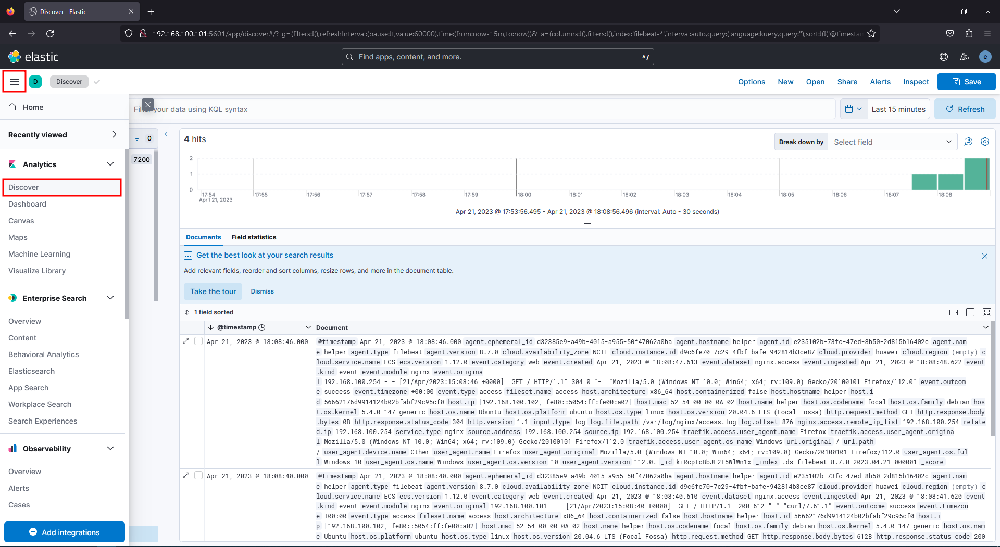
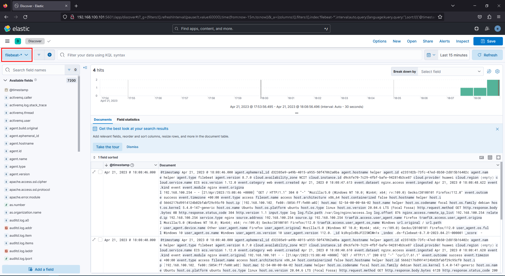
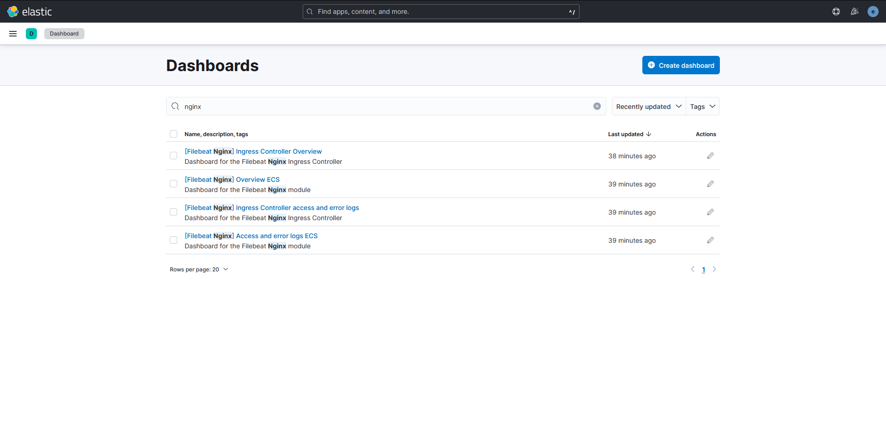

## Monitoring web server logs with Filebeat

As you might observe when opening Kibana and clicking around, it is quite empty
right now. That is because we don’t have any collected data in Elasticsearch. In
this section we will install and configure Filebeat in order to send Nginx logs
from our second VM to Elasticsearch.

### Before we begin

Since the `elastic` user has the `superuser` role, it can do any action in both
Kibana and Elasticsearch. In order to ingest metrics from various Beats, we will
need to connect to Elasticsearch and Kibana using a user with the right 
permissions. It is good practice to create such an user for every ingest source
you have, restricting the permissions to the minimum necessary 
([Principle of Least Privilege](https://en.wikipedia.org/wiki/Principle_of_least_privilege)),
but for brevity we will use the `elastic` user. You can read more about setting
up a user with the necessary permissions [here](https://www.elastic.co/guide/en/kibana/current/kibana-role-management.html)
and [here](https://kifarunix.com/configure-filebeat-elasticsearch-authentication/).

### Installing and configuring Filebeat

The installation process is similar to Elaticsearch and Kibana:

- Download the DEB package and signature
    
    ```shell-session
    root@helper:~# wget https://artifacts.elastic.co/downloads/beats/filebeat/filebeat-8.7.0-amd64.deb
    root@helper:~# wget https://artifacts.elastic.co/downloads/beats/filebeat/filebeat-8.7.0-amd64.deb.sha512
    ```
    
- Check the signature is ok
    
    ```shell-session
    root@helper:~# sha512sum -c filebeat-8.7.0-amd64.deb.sha512
    filebeat-8.7.0-amd64.deb: OK
    ```
    
- Install using `dpkg`
    
    ```shell-session
    root@helper:~# dpkg -i filebeat-8.7.0-amd64.deb
    Selecting previously unselected package filebeat.
    (Reading database ... 38899 files and directories currently installed.)
    Preparing to unpack filebeat-8.7.0-amd64.deb ...
    Unpacking filebeat (8.7.0) ...
    Setting up filebeat (8.7.0) ...
    Processing triggers for systemd (245.4-4ubuntu3.21) ...
    ```
    

Before we start sending log data we need to configure a few things.

Filebeat comes with multiple modules. Each module is responsible for parsing
specific application logs and sending them to Elasticsearch (or Logstash) with
minimal configuration necessary. To see a list of all the modules you can run:

```shell-session
root@helper:~# filebeat modules list
Enabled:

Disabled:
activemq
apache
auditd
aws
[...]
traefik
zeek
zookeeper
zoom
zscaler
```

We can see that no module is currently enabled. We are interested in Nginx logs.
Filebeat has the `nginx` module for that and we can enable it using the command
below.

```shell-session
root@helper:~# filebeat modules enable nginx
Enabled nginx
```

This renames the sample file `/etc/filebeat/modules.d/nginx.yml.disabled` to 
`/etc/filebeat/modules.d/nginx.yml`. For now, all log collection is still
disabled. **We need to edit the file and enable access and error log collection**
**by setting the `access.enabled` and `error.enabled` keys to `true`.**

```yaml
# Module: nginx
# Docs: https://www.elastic.co/guide/en/beats/filebeat/master/filebeat-module-nginx.html

- module: nginx
  # Access logs
  # highlight-start
  access:
    enabled: true
  # highlight-end

    # Set custom paths for the log files. If left empty,
    # Filebeat will choose the paths depending on your OS.
    #var.paths:

  # Error logs
  # highlight-start
  error:
    enabled: true
  # highlight-end

    # Set custom paths for the log files. If left empty,
    # Filebeat will choose the paths depending on your OS.
    #var.paths:

  # Ingress-nginx controller logs. This is disabled by default. It could be used in Kubernetes environments to parse ingress-nginx logs
  ingress_controller:
    enabled: false

    # Set custom paths for the log files. If left empty,
    # Filebeat will choose the paths depending on your OS.
    #var.paths:
```

#### Connecting to Elasticsearch and Kibana

Finally, we need to tell Filebeat how to connect to the Elasticsearch and
Kibana instances.

Before modifying the config we need to do two things:

- get the Elasticsearch server’s CA certificate
- copy it on the `helper` VM and install it

In order to get the CA server certificate, you can use the command below on the
`elk` machine.

```shell-session
[root@elk ~]# scp /etc/elasticsearch/certs/http_ca.crt student@192.168.100.102:~
```

In order to install the certificate, you can use the following commands on the
`helper` machine.

```shell-session
root@helper:~$ mkdir -p /usr/local/share/ca-certificates/extra
root@helper:~$ cp /home/student/http_ca.crt /usr/local/share/ca-certificates/extra/elastic.crt
root@helper:~$ update-ca-certificates
```

We will be using keystores in order to securely store usernames and passwords,
instead of simply writing them unencrypted in the configuration file.

In order to create a keystore and insert secrets, we can use the commands below.
Enter your username (`elastic`) and password (the password for the `elastic` user,
printed when setting up Elasticsearch).

:::danger
The `filebeat keystore` command needs to be run as the same user that will run
filebeat. We will run filebeat as root.
:::

```shell-session
root@helper:~# filebeat keystore create
Created filebeat keystore
root@helper:~# filebeat keystore add ES_USERNAME
Enter value for ES_USERNAME:
Successfully updated the keystore
root@helper:~# filebeat keystore add ES_PWD
Enter value for ES_PWD:
Successfully updated the keystore
root@helper:~# filebeat keystore list
ES_PWD
ES_USERNAME
```

Now, inside configuration files or CLI commands we can use these secrets we
defined as variables (e.g. `output.elasticsearch.password: "${ES_PWD}"` or
`-E "output.elasticsearch.password=\${ES_PWD}"`)

We did this so we can modify the `output.elasticsearch` section in 
`/etc/filebeat/filebeat.yml` to look like this:

```yml
output.elasticsearch:
  hosts: ["https://192.168.100.101:9200"]

  protocol: "https"

  username: "${ES_USERNAME}"
  password: "${ES_PWD}"
  tls:
    enabled: true
```

Also, setup the Kibana location

```yaml
setup.kibana:
  host: "192.168.100.101:5601"
```

:::tip
You can run `filebeat test config -e` in order to test the Filebeat configuration.
:::

To enable the default dashboards for the enabled module run

```shell-session
root@helper:~# filebeat setup -e --modules nginx -M "nginx.access.enabled=true" -M "nginx.error.enabled=true"
```

:::tip
The two `-M` options are required due to [a bug](https://github.com/elastic/beats/issues/30916)
in the version we are using.
:::

Now we can start the Filebeat service (as the `root` user)

```shell-session
root@helper:~# systemctl start filebeat
```

### Visualizing Filebeat data

:::caution
Before visualizing the data, generate some traffic to the webserver, from as
many sources as you can (local VM, Openstack VM, `elk` VM, your personal PC
using `ssh` SOCKS proxy). You can even try to request non-existent pages.
:::

The raw logs can be found by going to the `Analytics > Discover` tab and
selecting the `filebeat-*` index.





This is an unrefined view of the data. You can filter interesting fields by
pressing on them in the left side of the screen, under `Available fields`.

An useful way to visualize data is through dashboards. You can define your own
dashboards, but we’ll use the default ones created by filebeat by going to the
`Analytics > Dashboard` tab and searching for "nginx". 



The Ingress dashboards are not useful to us, since we are not in a Kubernetes
environment. Check out the "Overview ECS" and "Access and error logs ECS"
dashboards.

:::tip
You can filter in or out various values that you find in the tables and the
changes will be reflected in the graphs. You can also filter data using KQL
(Kibana Query Language) at the top of the page. Read more about it 
[here](https://www.elastic.co/guide/en/kibana/current/kuery-query.html).
:::

#### Task

Someone keeps trying to exploit/scan the web server. Determine the source IP of
the attacker using the Filebeat logs.

:::tip
You can identify the traffic in the Dashboard and filter accordingly in the
Discover tab.
:::

:::tip
You can also use `Security > Explore > Hosts`.
:::
