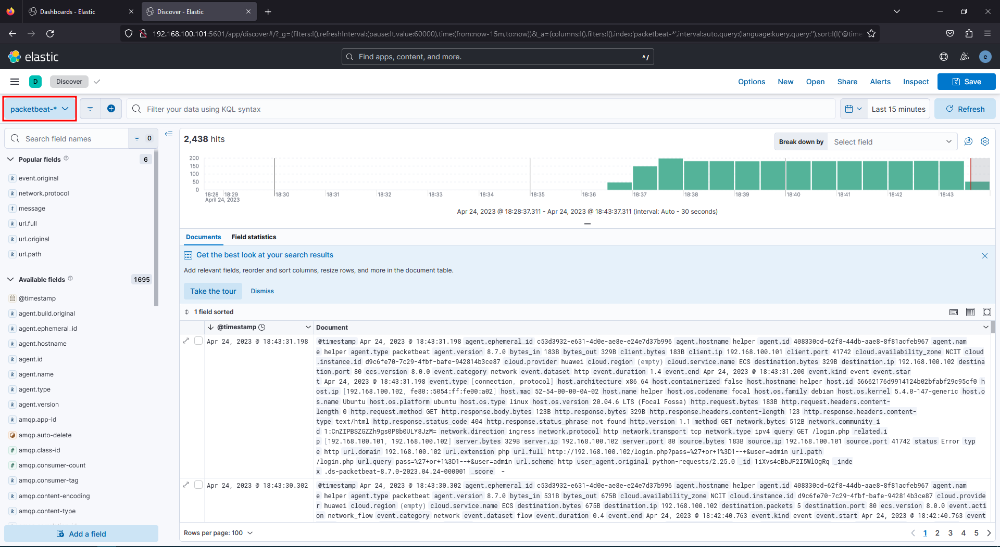
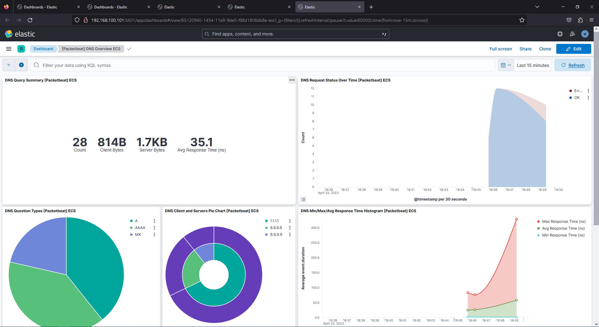
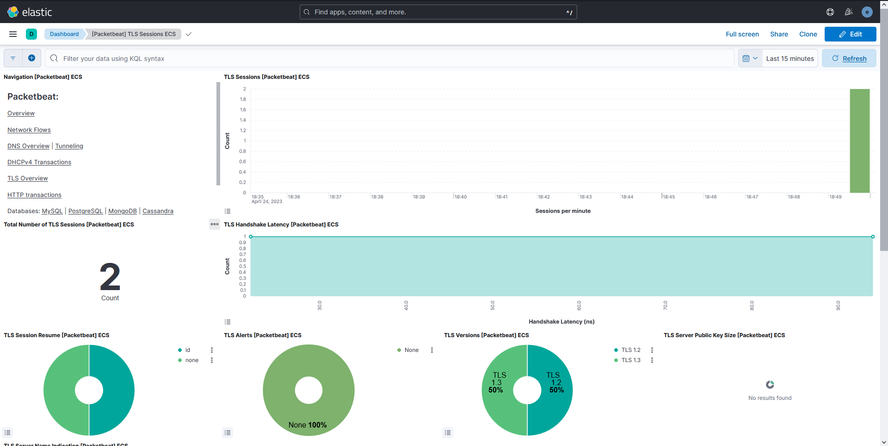

## Monitoring network traffic with Packetbeat

### Installing and configuring Packetbeat

Installing Packetbeat follows the same steps as Filebeat.

- Download the DEB package and signature
    
    ```shell-session
    student@helper:~$ wget https://artifacts.elastic.co/downloads/beats/packetbeat/packetbeat-8.7.0-amd64.deb
    student@helper:~$ wget https://artifacts.elastic.co/downloads/beats/packetbeat/packetbeat-8.7.0-amd64.deb.sha512
    ```
    
- Check the signature is ok
    
    ```shell-session
    student@helper:~$ sha512sum -c packetbeat-8.7.0-amd64.deb.sha512
    packetbeat-8.7.0-amd64.deb: OK
    ```
    
- Install using `dpkg`
    
    ```shell-session
    student@helper:~$ sudo dpkg -i packetbeat-8.7.0-amd64.deb
    Selecting previously unselected package packetbeat.
    (Reading database ... 41359 files and directories currently installed.)
    Preparing to unpack packetbeat-8.7.0-amd64.deb ...
    Unpacking packetbeat (8.7.0) ...
    Setting up packetbeat (8.7.0) ...
    Processing triggers for systemd (245.4-4ubuntu3.21) ...
    ```
    

The configuration file can be found at `/etc/packetbeat/packetbeat.yml`. Since
we are using Linux, we can change the sniffer type to a more efficient one than
the default by changing `packetbeat.interfaces.type` to `af_packet`. On other
platforms you need to use `libpcap`. Make sure it is installed on your system in
that case.

Next, modify the interfaces you want to capture traffic from. You can specify 
`any` to capture traffic from all interfaces, but, for the current lab we are 
interested only in the traffic that flows through interface `eth0`.

In the same file we can see the configurations for the protocols we want to 
sniff. It contains the most popular protocols and we will use it as is, but you
can define your own if needed.

#### Connecting to Elasticsearch and Kibana

As before, we need to setup a keystore for our sensitive data.

```shell-session
root@helper:~# packetbeat keystore create
Created packetbeat keystore
root@helper:~# packetbeat keystore add ES_USERNAME
Enter value for ES_USERNAME:
Successfully updated the keystore
root@helper:~# packetbeat keystore add ES_PWD
Enter value for ES_PWD:
Successfully updated the keystore
root@helper:~# packetbeat keystore add ES_CA_FINGERPRINT
Enter value for ES_CA_FINGERPRINT:
Successfully updated the keystore
```

Once you have done that, follow the instructions from the Filebeat section to
specify the location of Elasticsearch and Kibana. The parameters used in the 
configuration are the same. You can check that your configuration file is ok
with `packetbeat test config -e`.

Finally, setup dashboards and ingest pipelines with `packetbeat setup -e` and 
start Packetbeat.

```shell-session
root@helper:~# systemctl daemon-reload
root@helper:~# systemctl enable --now packetbeat
Synchronizing state of packetbeat.service with SysV service script with /lib/systemd/systemd-sysv-install.
Executing: /lib/systemd/systemd-sysv-install enable packetbeat
Created symlink /etc/systemd/system/multi-user.target.wants/packetbeat.service → /lib/systemd/system/packetbeat.service.
```

### Visualizing Packetbeat data

Before going to Kibana, generate both some outbound traffic (web traffic using 
wget/curl, DNS requests using host/dig, ICMP traffic using ping) and inbound 
traffic by hitting the webserver from the previous section or by pinging the 
`helper` VM from the outside (Openstack VM, `elk` VM).

As before, you can view the raw logs and filter the fields that interest you in
the `Analytics > Discover` tab. Packetbeat will send logs to a different index, 
so make sure to switch it from the upper left corner.



In order to view the Packetbeat dashboards, go to the `Analytics > Dashboards`
tab and search for Packetbeat. Take a look at the dashboards for the traffic you
have generated.





#### Task

There is a service that is slowly exfiltrating data from the monitored machine.
Can you spot the exfiltrated data using the Packetbeat dashboards and logs?