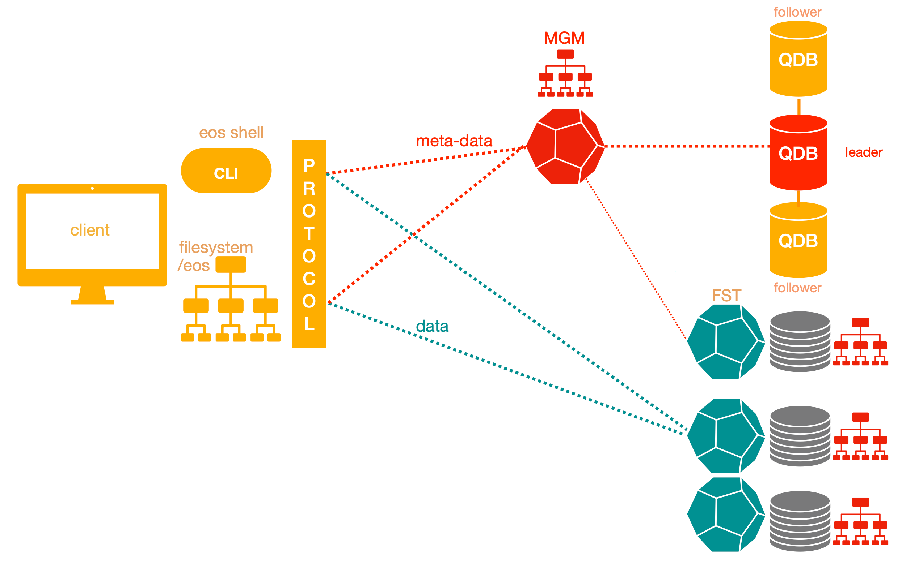
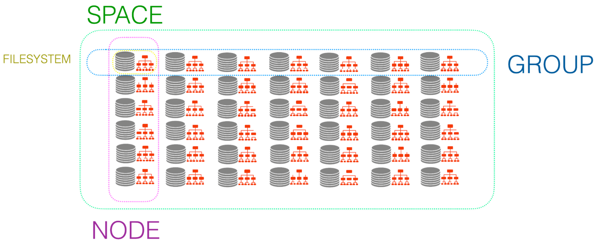

## Setup

We will be using a virtual machine in the [faculty's cloud](http://cloud.grid.pub.ro/).

When creating a virtual machine in the Launch Instance window:
  * Name your VM using the following convention: `scgc_lab<no>_<username>`,
where `<no>` is the lab number and `<username>` is your institutional account.
  * Select **Boot from image** in **Instance Boot Source** section
  * Select **SCGC Template** in **Image Name** section
  * Select the **m1.eos** flavor.

In the base virtual machine:
  * Download the laboratory archive from [here](https://repository.grid.pub.ro/cs/scgc/laboratoare/lab-eos.zip) in the `work` directory.
Use: `wget https://repository.grid.pub.ro/cs/scgc/laboratoare/lab-eos.zip` to download the archive.

  * Extract the archive.
The `.qcow2` files will be used to start virtual machines using the `runvm.sh` script.
  * Start the virtual machines using `bash runvm.sh`.
  * The username for connecting to the nested VMs is `student` and the password is `student`.

```shell-session
$ # change the working dir
$ cd ~/work
$ # download the AlmaLinux 9 image
$ wget https://repository.grid.pub.ro/cs/scgc/laboratoare/base-images/almalinux-9.qcow2
$ # download the archive
$ wget https://repository.grid.pub.ro/cs/scgc/laboratoare/lab-eos.zip
$ unzip lab-eos.zip
$ # start VMs; it may take a while
$ bash runvm.sh
$ # check if the VMs booted
$ virsh net-dhcp-leases labvms
```

There will be five virtual machines that are created. You must add them to the `/etc/hosts` file on the host to be able to refer to the VMs by name instead of by their IP addresses.

```
192.168.100.11 fst-1
192.168.100.12 fst-2
192.168.100.13 fst-3
192.168.100.14 mgm
192.168.100.15 qdb
```


## EOS Intro
[EOS](https://eos-web.web.cern.ch/eos-web/) is a distributed disk storage system developed to meet the demanding data requirements of physics experiments at [CERN](https://eos-web.web.cern.ch/eos-web/). It provides low-latency remote access to stored data, making it well-suited for large-scale physics analysis. Designed to efficiently manage multi-PB file namespaces, EOS serves as the primary storage system at the CERN IT data center, as well as at numerous sites across the Worldwide LHC Computing Grid (WLCG).

## EOS Architecture
From an architectural point of view, EOS is divided in metadata and data storage components. An EOS instance is composed of three core services:
* **MGM**: The manager service responsible for handling the metadata of all files and directories in an EOS instance. It serves as the entry point for external clients, handling authentication and authorization. It provides clients with a hierarchical view of the stored data and, during read and write operations, translates logical file paths into physical locations on the data nodes, redirecting clients accordingly. Additionally, the MGM oversees background tasks such as load balancing and the overall coordination of storage nodes.
* **FST**: Manages the physical storage. An EOS instance can have multiple FSTs, each able to manage several disks.
* **QuarkDB** (QDB): Database that offers persistent storage for metadata of all files and
directories on the EOS instance, with the MGM caching the recently accessed entries.

To interact with an EOS instance, EOS provides a command-line interface called the EOS console, which we will also use during this lab to manage our own EOS instances.



EOS provides three conceptual views of the storage space:
* **Filesystem (fs) view**: contains all filesystems that store data.
* **Node view**: groups filesystems by their hosting FST nodes.
* **Group view**: organizes filesystems into scheduling groups.

We will interact with these three views when setting up the EOS instance.



## Setting up an EOS instance
Since EOS is a distributed storage system, the setup script creates a cluster consisting of five AlmaLinux 9 machines: mgm, qdb, fst-1, and fst-2, fst-3. These nodes will host the services required for our EOS deployment.

Each core EOS service (MGM, QDB, and FST) runs as a daemon on its dedicated machine. For a correct configuration, the services must be initialized in the following order: QDB, MGM, and finally the FSTs.

Before proceeding with the EOS setup, ensure that all cluster hostnames are listed in `/etc/hosts` on every machine. This is  **critical** for proper name resolution and communication between nodes.

:::warning
EOS requires that **each node must have a domain in its hostname** (e.g., `mgm.spd.ro`, not just `mgm`) and **each node hostname must resolve to its network IP address, not to `127.0.0.1`**.

On each machine, configure `/etc/hosts` as follows:

```
127.0.0.1   localhost localhost.localdomain localhost4 localhost4.localdomain4
::1         localhost localhost.localdomain localhost6 localhost6.localdomain6

192.168.100.14  mgm.spd.ro
192.168.100.15  qdb.spd.ro
192.168.100.11  fst-1.spd.ro
192.168.100.12  fst-2.spd.ro
192.168.100.13  fst-3.spd.ro
```

Also set the hostname on each node:

```shell-session
# On MGM node:
[root@mgm ~]$ hostnamectl set-hostname mgm.spd.ro

# On QDB node:
[root@qdb ~]$ hostnamectl set-hostname qdb.spd.ro

# On each FST node:
[root@fst-1 ~]$ hostnamectl set-hostname fst-1.spd.ro
# Repeat for fst-2.spd.ro and fst-3.spd.ro

# Verify the configuration on each node:
[root@mgm ~]$ hostname -i
192.168.100.14
# The output must be the network IP (e.g., `192.168.100.14`), not `127.0.0.1`.
```
:::


In this setup, we will use the eos daemon command to configure and manage the EOS services.

### QDB Setup
The QDB node is responsible for maintaining the database that stores the file metadata of the EOS instance, including details such as file location, attributes, and ownership.

To allow the other EOS services to communicate with the QDB service, make sure that TCP port 7777 is open on the QDB host:

```shell-session
[root@qdb ~]$ firewall-cmd --permanent --add-port=7777/tcp
success
[root@qdb ~]$ firewall-cmd --reload
success
```

We will start by generating the default QDB configuration file:

```shell-session
[root@qdb ~]$ eos daemon config qdb
# Config file at: /etc/eos/config/qdb/qdb
```

This configuration file `/etc/eos/config/qdb/qdb` defines the QuarkDB service for the EOS cluster. In our setup, the default configuration is ready to use and does not need any changes.

Let’s inspect its contents:

```shell-session
[root@qdb ~]$ cat /etc/eos/config/qdb/qdb
[sysconfig]

# ----------------------
# name of this QDB node
# ----------------------
QDB_HOST=${SERVER_HOST}

# defaults
QDB_PORT=7777
QDB_CLUSTER_ID=${INSTANCE_NAME}
QDB_NODE=${QDB_HOST}:${QDB_PORT}
QDB_NODES=${QDB_HOST}:${QDB_PORT}
QDB_PATH=/var/lib/qdb


[init]
test -d ${QDB_PATH} || quarkdb-create --path ${QDB_PATH} --clusterID ${QDB_CLUSTER_ID} --nodes ${QDB_NODES}
chown -R daemon:daemon ${QDB_PATH}

[qdb:xrootd:qdb]
xrd.port ${QDB_PORT}
xrd.protocol redis:${QDB_PORT} libXrdQuarkDB.so

redis.database /var/lib/qdb
redis.mode raft
redis.myself ${QDB_NODE}
```

A few important points to pay attention to in the config file:
* Service parameters such as host, port, cluster ID and storage path for the QDB service.
* Initialization script to create the database directory if it does not yet exist and to set the appropriate permissions. The directory must be owned by the daemon user.
* Raft mode (`redis.mode raft`):
QuarkDB relies on the [Raft consensus algorithm](https://raft.github.io/) to ensure that all metadata changes are consistently replicated across QDB nodes. In a multi-node deployment, one node acts as the leader while others follow, providing fault tolerance and consistency.
In this single-node test setup, Raft is still enabled, but the node serves as both leader and follower. In production, multiple QDB nodes are recommended to fully leverage the high-availability design of Raft.

* Redis compatibility:
The QDB database can be queried and interacted with using standard [Redis protocol](https://redis.io/learn/develop/node/nodecrashcourse/whatisredis). This allows the other EOS services, MGM and FST, to communicate with the metadata database efficiently.

Every instance must have a unique instance-private shared secret. The command will create a local file /etc/eos.keytab storing the instance-specific shared secret needed for MGM,FST,MQ:

```shell-session
[root@qdb ~]$ eos daemon sss recreate
```

Now everything is set up to run the QDB service:

```shell-session
[root@qdb ~]$ eos daemon run qdb
EOS_USE_MQ_ON_QDB=1
EOS_XROOTD=/opt/eos/xrootd/
GEO_TAG=local
INSTANCE_NAME=eosdev
LD_LIBRARY_PATH=/opt/eos/xrootd//lib64:/opt/eos/grpc/lib64
LD_PRELOAD=/usr/lib64/libjemalloc.so
QDB_CLUSTER_ID=eosdev
QDB_HOST=qdb.spd.ro
QDB_NODE=qdb.spd.ro:7777
QDB_NODES=qdb.spd.ro:7777
QDB_PATH=/var/lib/qdb
QDB_PORT=7777
SERVER_HOST=qdb.spd.ro
# ---------------------------------------
# ------------- i n i t -----------------
# ---------------------------------------
# run: mkdir -p /var/run/eos/
# run: chown daemon:root /var/run/eos/
# run: mkdir -p /var/cache/eos/
# run: chown daemon:root /var/cache/eos/
# run: if [ -e /etc/eos.keytab ]; then chown daemon /etc/eos.keytab ; chmod 400 /etc/eos.keytab ; fi
# run: mkdir -p /var/eos/md /var/eos/report
# run: chmod 755 /var/eos /var/eos/report
# run: mkdir -p /var/spool/eos/core/mgm /var/spool/eos/core/mq /var/spool/eos/core/fst /var/spool/eos/core/qdb /var/spool/eos/admin
# run: mkdir -p /var/log/eos
# run: chown -R daemon /var/spool/eos
# run: find /var/log/eos -maxdepth 1 -type d -exec chown daemon {} \;
# run: find /var/eos/ -maxdepth 1 -mindepth 1 -not -path "/var/eos/fs" -not -path "/var/eos/fusex" -type d -exec chown -R daemon {} \;
# run: chmod -R 775 /var/spool/eos
# run: mkdir -p /var/eos/auth /var/eos/stage
# run: chown daemon /var/eos/auth /var/eos/stage
# run: setfacl -m default:u:daemon:r /var/eos/auth/
# run: test -d ${QDB_PATH} || quarkdb-create --path ${QDB_PATH} --clusterID ${QDB_CLUSTER_ID} --nodes ${QDB_NODES}
# run: chown -R daemon:daemon ${QDB_PATH}
# ---------------------------------------
# ------------- x r o o t d  ------------
# ---------------------------------------
# running config file: /var/run/eos/xrd.cf.qdb
# ---------------------------------------
xrd.port 7777
xrd.protocol redis:7777 libXrdQuarkDB.so
redis.database /var/lib/qdb
redis.mode raft
redis.myself qdb.spd.ro:7777
redis.password_file /etc/eos.keytab

#########################################
```

The command above shows the environment variables, initialization steps, and configuration details used to start the QuarkDB service.

The log file located at `/var/log/eos/qdb/xrdlog.qdb` contains detailed startup information and potential error messages. Let’s inspect it to confirm that the QDB service has launched successfully:

```shell-session
[root@qdb ~]$ less +G /var/log/eos/qdb/xrdlog.qdb
251005 09:46:48 24411 Starting on Linux 5.14.0-503.14.1.el9_5.x86_64
251005 09:46:48 24411 eos-qdb -n qdb -c /var/run/eos/xrd.cf.qdb -l /var/log/eos/xrdlog.qdb -R daemon -k fifo -s /var/run/eos/xrd.qdb.qdb.pid
Copr.  2004-2012 Stanford University, xrd version 5.8.4
++++++ eos-qdb qdb@qdb.spd.ro initialization started.
Config using configuration file /var/run/eos/xrd.cf.qdb
=====> xrd.port 7777
=====> xrd.protocol redis:7777 libXrdQuarkDB.so 
Config maximum number of connections restricted to 524288
Config maximum number of threads restricted to 5569
Plugin protocol libXrdQuarkDB-5.so not found; falling back to using libXrdQuarkDB.so
Plugin Unable to find symbol XrdgetProtocolPort in protocol libXrdQuarkDB.so
Copr.  2012 Stanford University, xroot protocol 5.1.0 version 5.8.4
++++++ xroot protocol initialization started.
[...]
------ quarkdb protocol plugin initialization completed.
------ eos-qdb qdb@qdb.spd.ro:7777 initialization completed.
[...]
```

Once the QDB service is running successfully, open another terminal and check its status using the [Redis CLI](https://redis.io/docs/latest/develop/tools/cli/):

```shell-session
[root@qdb ~]$ redis-cli -p 7777 raft-info
 1) TERM 1
 2) LOG-START 0
 3) LOG-SIZE 159
 4) LEADER qdb.spd.ro:7777
 5) CLUSTER-ID eosdev
 6) COMMIT-INDEX 158
 7) LAST-APPLIED 158
 8) BLOCKED-WRITES 0
 9) LAST-STATE-CHANGE 642 (10 minutes, 42 seconds)
10) ----------
11) MYSELF qdb.spd.ro:7777
12) VERSION 5.3.22.1
13) STATUS LEADER
14) NODE-HEALTH GREEN
15) JOURNAL-FSYNC-POLICY sync-important-updates
16) ----------
17) MEMBERSHIP-EPOCH 0
18) NODES qdb.spd.ro:7777
19) OBSERVERS 
20) QUORUM-SIZE 1
```

The output confirms that the QDB node is healthy, acting as the Raft leader, and that the cluster is functioning.

### MGM Setup
Next we will move on to launch the MGM service, the manager node of the EOS instance. We will further use this node to interact with the EOS intance.

:::warning
To enable communication between QDB and MGM, copy the `/etc/eos.keytab` file created on the QDB file on the MGM file.
:::

Enure that TCP port 1094 is open on the MGM to allow the other EOS services to communicate with the MGM service:

```shell-session
[root@mgm ~]$ firewall-cmd --permanent --add-port=1094/tcp
success
[root@mgmb ~]$ firewall-cmd --reload
success
```

Generate the default configuration file for the MGM service:

```shell-session
[root@mgm ~]$ eos daemon config mgm
# Config file at: /etc/eos/config/mgm/mgm
```

Edit `/etc/eos/config/mgm/mgm` to set the correct hostname and port of QDB service:

```shell-session
[root@mgm ~]$ grep mgmofs.qdbcluster /etc/eos/config/mgm/mgm
mgmofs.qdbcluster qdb.spd.ro:7777
```

Let's inspect the MGM config file:

```shell-session
[root@mgm ~]$ cat /etc/eos/config/mgm/mgm
# ------------------------------------------------------------ #
[mgm:xrootd:mgm]
# ------------------------------------------------------------ #

###########################################################
xrootd.fslib libXrdEosMgm.so
xrootd.seclib libXrdSec.so
xrootd.async off nosf
xrootd.chksum adler32
###########################################################
xrd.sched mint 8 maxt 256 idle 64
###########################################################
all.export / nolock
all.role manager
###########################################################
oss.fdlimit 16384 32768
###########################################################
# UNIX authentication
sec.protocol unix

# SSS authentication
sec.protocol sss -c /etc/eos.keytab -s /etc/eos.keytab

###########################################################
sec.protbind [::ffff:127.0.0.1] unix sss
sec.protbind localhost.localdomain unix sss
sec.protbind localhost unix sss
sec.protbind * only ${KRB5} ${GSI} sss unix
###########################################################

[...]

#-------------------------------------------------------------------------------
# Set the namespace plugin implementation
#-------------------------------------------------------------------------------
mgmofs.nslib /usr/lib64/libEosNsQuarkdb.so

# Quarkdb custer configuration used for the namespace
mgmofs.qdbcluster qdb.spd.ro:7777
mgmofs.qdbpassword_file /etc/eos.keytab

[...]
```

The configuration file above defines various settings for the MGM service, including MGM-specific variables, cluster authentication mechanisms, and the QDB connection details.

Now that the MGM configuration is set, let’s start the MGM service:

```shell-session
[root@mgm ~]$ eos daemon run mgm
DAEMON_COREFILE_LIMIT=unlimited
EOS_ALLOW_SAME_HOST_IN_GROUP=1
EOS_AUTOLOAD_CONFIG=default
EOS_BROKER_URL=root://localhost:1097//eos/
EOS_GEOTAG=local
EOS_HTTP_CONNECTION_MEMORY_LIMIT=4194304
EOS_HTTP_THREADPOOL=epoll
EOS_HTTP_THREADPOOL_SIZE=16
EOS_INSTANCE_NAME=eosdev
EOS_MGM_ALIAS=mgm.spd.ro
EOS_MGM_FUSEX_MAX_CHILDREN=262144
EOS_MGM_HOST=mgm.spd.ro
EOS_MGM_HOST_TARGET=mgm.spd.ro
EOS_MGM_HTTP_PORT=8000
EOS_MGM_LISTING_CACHE=0
EOS_MGM_MASTER1=mgm.spd.ro
EOS_MGM_MASTER2=mgm.spd.ro
EOS_NO_STACKTRACE=1
EOS_NS_ACCOUNTING=1
EOS_START_SYNC_SEPARATELY=1
EOS_SYNCTIME_ACCOUNTING=1
EOS_USE_MQ_ON_QDB=1
EOS_UTF8=""
EOS_XROOTD=/opt/eos/xrootd/
GEO_TAG=local
GSI=
INSTANCE_NAME=eosdev
KRB5=
KRB5RCACHETYPE=none
LD_LIBRARY_PATH=/opt/eos/xrootd//lib64:/opt/eos/grpc/lib64
LD_PRELOAD=/usr/lib64/libjemalloc.so
SERVER_HOST=mgm.spd.ro
XDG_CACHE_HOME=/var/cache/eos/
# ---------------------------------------
# ------------- i n i t -----------------
# ---------------------------------------
# run: mkdir -p /var/run/eos/
# run: chown daemon:root /var/run/eos/
# run: mkdir -p /var/cache/eos/
# run: chown daemon:root /var/cache/eos/
# run: if [ -e /etc/eos.keytab ]; then chown daemon /etc/eos.keytab ; chmod 400 /etc/eos.keytab ; fi
# run: mkdir -p /var/eos/md /var/eos/report
# run: chmod 755 /var/eos /var/eos/report
# run: mkdir -p /var/spool/eos/core/mgm /var/spool/eos/core/mq /var/spool/eos/core/fst /var/spool/eos/core/qdb /var/spool/eos/admin
# run: mkdir -p /var/log/eos
# run: chown -R daemon /var/spool/eos
# run: find /var/log/eos -maxdepth 1 -type d -exec chown daemon {} \;
# run: find /var/eos/ -maxdepth 1 -mindepth 1 -not -path "/var/eos/fs" -not -path "/var/eos/fusex" -type d -exec chown -R daemon {} \;
# run: chmod -R 775 /var/spool/eos
# run: mkdir -p /var/eos/auth /var/eos/stage
# run: chown daemon /var/eos/auth /var/eos/stage
# run: setfacl -m default:u:daemon:r /var/eos/auth/
# ---------------------------------------
# ------------- x r o o t d  ------------
# ---------------------------------------
# running config file: /var/run/eos/xrd.cf.mgm
# ---------------------------------------
xrootd.fslib libXrdEosMgm.so
xrootd.seclib libXrdSec.so
xrootd.async off nosf
xrootd.chksum adler32
xrd.sched mint 8 maxt 256 idle 64
all.export / nolock
all.role manager
oss.fdlimit 16384 32768
sec.protocol unix
sec.protocol sss -c /etc/eos.keytab -s /etc/eos.keytab
sec.protbind [::ffff:127.0.0.1] unix sss
sec.protbind localhost.localdomain unix sss
sec.protbind localhost unix sss
sec.protbind * only   sss unix
mgmofs.fs /
mgmofs.targetport 1095
mgmofs.broker root://localhost:1097//eos/
mgmofs.instance eosdev
mgmofs.metalog /var/eos/md
mgmofs.txdir /var/eos/tx
mgmofs.authdir /var/eos/auth
mgmofs.archivedir /var/eos/archive
mgmofs.qosdir /var/eos/qos
mgmofs.reportstorepath /var/eos/report
mgmofs.autoloadconfig default
mgmofs.qoscfg /var/eos/qos/qos.conf
mgmofs.auththreads 64
mgmofs.authport 15555
mgmofs.authlocal 1
mgmofs.fstgw someproxy.cern.ch:3001
mgmofs.nslib /usr/lib64/libEosNsQuarkdb.so
mgmofs.qdbcluster qdb.spd.ro:7777
mgmofs.qdbpassword_file /etc/eos.keytab

#########################################
Register objects provided by NsQuarkdbPlugin ...

```

Using the `eos ns` command, let’s inspect the namespace of the EOS instance. The namespace is active, but no read or write operations have been performed yet:

```shell-session
[root@mgm ~]$ eos ns | head
# ------------------------------------------------------------------------------------
# Namespace Statistics
# ------------------------------------------------------------------------------------
ALL      Files                            7 [booted] (0s)
ALL      Directories                      18
ALL      Total boot time                  1 s
ALL      Contention                       write: 0.00 % read:0.00 %
# ------------------------------------------------------------------------------------
ALL      Replication                      is_master=true master_id=mgm.spd.ro:1094
# ------------------------------------------------------------------------------------
```

To verify that the MGM service started successfully, inspect the log file `/var/log/eos/mgm/xrdlog.mgm` or initialization messages:
```shell-session
[root@mgm ~]$ less +G /var/log/eos/mgm/xrdlog.mgm
251006 11:23:28 24249 Starting on Linux 5.14.0-503.14.1.el9_5.x86_64
251006 11:23:28 24249 eos-mgm -n mgm -c /var/run/eos/xrd.cf.mgm -l /var/log/eos/xrdlog.mgm -R daemon -s /var/run/eos/xrd.mgm.mgm.pid
Copr.  2004-2012 Stanford University, xrd version 5.8.4
++++++ eos-mgm mgm@mgm.spd.ro initialization started.
Config using configuration file /var/run/eos/xrd.cf.mgm
=====> xrd.sched mint 8 maxt 256 idle 64
Config maximum number of connections restricted to 524288
Config maximum number of threads restricted to 5569
Copr.  2012 Stanford University, xroot protocol 5.1.0 version 5.8.4
++++++ xroot protocol initialization started.
=====> xrootd.fslib libXrdEosMgm.so
=====> xrootd.seclib libXrdSec.so
=====> xrootd.async off nosf
=====> xrootd.chksum adler32
=====> all.export / nolock
Config exporting /
Plugin loaded secprot 5.8.4 from seclib libXrdSec-5.so
[...]
------ xroot protocol initialization completed.
------ eos-mgm mgm@mgm.spd.ro:1094 initialization completed.
[...]
```

#### Interacting with EOS

Now that our MGM node is up and running, we can interact with our EOS instance through a console-like interface that provides access to the full EOS command set. 

To open the EOS console, simply run the command `eos` and when the console starts, you’ll see a banner similar to this:

```shell-session
[root@mgm ~]$ eos
# ---------------------------------------------------------------------------
# EOS  Copyright (C) 2011-2025 CERN/Switzerland
# This program comes with ABSOLUTELY NO WARRANTY; for details type `license'.
# This is free software, and you are welcome to redistribute it 
# under certain conditions; type `license' for details.
# ---------------------------------------------------------------------------
EOS_INSTANCE=eosdev
EOS_SERVER_VERSION=5.3.21 EOS_SERVER_RELEASE=1
EOS_CLIENT_VERSION=5.3.21 EOS_CLIENT_RELEASE=1
EOS Console [root://localhost] |/> 
```

We are currently using the root user, so the console starts with administrative privileges, allowing us to access all EOS management commands. Otherwise, use the `sudo` prefix to start the console, since without it you will have access to a limited set of commands.

You can explore available commands by pressing TAB, which will display the complete list of commands. Let's try a few basic commands:

```shell-session
EOS Console [root://localhost] |/> 
.q          archive     chmod       convert     df          fileinfo    fusex       info        ln          motd        oldfind     rclone      rm          sched       stat        touch       whoami      
?           attr        chown       cp          du          find        geosched    inspector   ls          mv          pwd         reconnect   rmdir       scitoken    status      tracker     
access      backup      clear       daemon      evict       fs          group       io          map         newfind     qos         recycle     role        silent      test        version     
accounting  cat         config      debug       exit        fsck        health      json        member      node        quit        register    route       space       timing      vid         
acl         cd          console     devices     file        fuse        help        license     mkdir       ns          quota       report      rtlog       squash      token       who         
EOS Console [root://localhost] |/> whoami
Virtual Identity: uid=0 (0,3,65534) gid=0 (0,4,65534) [authz:sss] sudo* host=localhost domain=localdomain
```

To check out detailed usage information for any command, add the `-h` flag:

```shell-session
EOS Console [root://localhost] |/> attr -h
'[eos] attr ..' provides the extended attribute interface for directories in EOS.
Usage: attr [OPTIONS] ls|set|get|rm ...
Options:
attr [-r] ls <identifier> :
                                                : list attributes of path
 -r : list recursive on all directory children
attr [-r] set [-c] <key>=<value> <identifier> :
                                                : set attributes of path (-r : recursive) (-c : only if attribute does not exist already)
attr [-r] set default=replica|raiddp|raid5|raid6|archive|qrain <identifier> :
                                                : set attributes of path (-r recursive) to the EOS defaults for replicas, dual-parity-raid (4+2), raid-6 (4+2) or archive layouts (5+3).
 -r : set recursive on all directory children
attr [-r] [-V] get <key> <identifier> :
                                                : get attributes of path (-r recursive)
 -r : get recursive on all directory children
 -V : only print the value
attr [-r] rm  <key> <identifier> :
                                                : delete attributes of path (-r recursive)

 -r : delete recursive on all directory children
attr [-r] link <origin> <identifier> :
                                                : link attributes of <origin> under the attributes of <identifier> (-r recursive)

 -r : apply recursive on all directory children
attr [-r] unlink <identifier> :
                                                : remove attribute link of <identifier> (-r recursive)

 -r : apply recursive on all directory children
attr [-r] fold <identifier> :
                                                : fold attributes of <identifier> if an attribute link is defined (-r recursive)

                                                  all attributes which are identical to the origin-link attributes are removed locally
 -r : apply recursive on all directory children
```

You can also execute EOS commands directly from your console without entering the interactive console. In this case, simply prefix each command with `eos`, for example:

```shell-session
[root@mgm ~]$ eos whoami
Virtual Identity: uid=0 (0,3,65534) gid=0 (0,4,65534) [authz:sss] sudo* host=localhost domain=localdomain
```

### FSTs Setup

The FSTs are the nodes responsible for storing the actual physical data. In our EOS deployment, we will configure three FST nodes.

:::warning
To enable communication between FST and the other services, copy the `/etc/eos.keytab` file created on the QDB file on the MGM file.
:::

Before proceeding to the actual FST setup, we have to create the default storage space for the EOS instance:
```shell-session
[root@mgm ~]$ eos space define default
info: creating space 'default'
```

The command above creates a logical storage space named default. After defining the space, activate it:

```shell-session
[root@mgm ~]$ eos space set default on
```

Check out the EOS space configuration:

```shell-session
[root@mgm ~]$ eos space ls
┌──────────┬────────────────┬────────────┬────────────┬──────┬─────────┬───────────────┬──────────────┬─────────────┬─────────────┬──────────────┬──────┬──────┬──────────┬───────────┬───────────┬──────┬────────┬───────────┬──────┬────────┬───────────┐
│type      │            name│   groupsize│    groupmod│ N(fs)│ N(fs-rw)│ sum(usedbytes)│ sum(capacity)│ capacity(rw)│ nom.capacity│sched.capacity│ usage│ quota│ balancing│  threshold│  converter│   ntx│  active│        wfe│   ntx│  active│ intergroup│
└──────────┴────────────────┴────────────┴────────────┴──────┴─────────┴───────────────┴──────────────┴─────────────┴─────────────┴──────────────┴──────┴──────┴──────────┴───────────┴───────────┴──────┴────────┴───────────┴──────┴────────┴───────────┘
 spaceview           default            0            24      0         0             0 B            0 B           0 B           0 B            0 B   0.00    off        off          20         off      0        0         off      1        0         off 
```

The default space is listed with its group settings, usage, and capacity, both currently empty. To provide actual storage, FST nodes need to be added to the EOS deployment.

Let’s register a filesystem under each `/data01` and `/data02` directories on each FST node, specifying the unique ID, hostname, service port, storage path, and the logical space group in which the filesystem will be placed:

```shell-session
[root@mgm ~]$ eos fs add fs-1 fst-1.spd.ro:1095 /data01
[root@mgm ~]$ eos fs add fs-2 fst-1.spd.ro:1095 /data02
[root@mgm ~]$ eos fs add fs-3 fst-2.spd.ro:1095 /data01
[root@mgm ~]$ eos fs add fs-4 fst-2.spd.ro:1095 /data02
[root@mgm ~]$ eos fs add fs-5 fst-3.spd.ro:1095 /data01
[root@mgm ~]$ eos fs add fs-6 fst-3.spd.ro:1095 /data02
```

To check that the filesystems were created, run:
```shell-session
[root@mgm ~]# eos fs ls
┌────────────────────────┬────┬──────┬────────────────────────────────┬────────────────┬────────────────┬────────────┬──────────────┬────────────┬──────┬────────┬────────────────┐
│host                    │port│    id│                            path│      schedgroup│          geotag│        boot│  configstatus│       drain│ usage│  active│          health│
└────────────────────────┴────┴──────┴────────────────────────────────┴────────────────┴────────────────┴────────────┴──────────────┴────────────┴──────┴────────┴────────────────┘
 fst-1.spd.ro             1095      1                          /data01        default.0                                          off      nodrain   0.00                           
 fst-1.spd.ro             1095      2                          /data02        default.1                                          off      nodrain   0.00                           
 fst-2.spd.ro             1095      3                          /data01        default.2                                          off      nodrain   0.00                           
 fst-2.spd.ro             1095      4                          /data02        default.3                                          off      nodrain   0.00                           
 fst-3.spd.ro             1095      5                          /data01        default.4                                          off      nodrain   0.00                           
 fst-3.spd.ro             1095      6                          /data02        default.5                                          off      nodrain   0.00                           
```

By default, EOS automatically assigns each newly created filesystem to its own group. Therefore after registration, EOS will create six scheduling groups:
default.0 - default.5. When writing data, EOS selects a single group and stores the file only on the filesystems that belong to that group. For example, to store files with two replicas, at least two filesystems must be in the same group. To use erasure coding, six filesystems are required per group. To enable both replication and erasure coding across on our EOS instance, we’ll move all the filesystems into a single group, `default.0`:

```shell-session
[root@mgm ~]# for name in 2 3 4 5 6; do eos fs mv --force $name default.0; done
info: applying space config drainperiod=86400
info: applying space config graceperiod=86400
info: applying space config scan_rain_interval=2419200
info: applying space config scaninterval=604800
info: applying space config scanrate=100
success: filesystem 2 moved to group default.0
info: applying space config drainperiod=86400
info: applying space config graceperiod=86400
info: applying space config scan_rain_interval=2419200
info: applying space config scaninterval=604800
info: applying space config scanrate=100
success: filesystem 3 moved to group default.0
info: applying space config drainperiod=86400
info: applying space config graceperiod=86400
info: applying space config scan_rain_interval=2419200
info: applying space config scaninterval=604800
info: applying space config scanrate=100
success: filesystem 4 moved to group default.0
info: applying space config drainperiod=86400
info: applying space config graceperiod=86400
info: applying space config scan_rain_interval=2419200
info: applying space config scaninterval=604800
info: applying space config scanrate=100
success: filesystem 5 moved to group default.0
info: applying space config drainperiod=86400
info: applying space config graceperiod=86400
info: applying space config scan_rain_interval=2419200
info: applying space config scaninterval=604800
info: applying space config scanrate=100
success: filesystem 6 moved to group default.0
```

Run `eos fs ls` again to ensure that all the filesystems were moved into the `default.0` group:

```shell-session
[root@mgm ~]# eos fs ls
┌────────────────────────┬────┬──────┬────────────────────────────────┬────────────────┬────────────────┬────────────┬──────────────┬────────────┬──────┬────────┬────────────────┐
│host                    │port│    id│                            path│      schedgroup│          geotag│        boot│  configstatus│       drain│ usage│  active│          health│
└────────────────────────┴────┴──────┴────────────────────────────────┴────────────────┴────────────────┴────────────┴──────────────┴────────────┴──────┴────────┴────────────────┘
 fst-1.spd.ro             1095      1                          /data01        default.0                                          off      nodrain   0.00                           
 fst-1.spd.ro             1095      2                          /data02        default.0                                          off      nodrain   0.00                           
 fst-2.spd.ro             1095      3                          /data01        default.0                                          off      nodrain   0.00                           
 fst-2.spd.ro             1095      4                          /data02        default.0                                          off      nodrain   0.00                           
 fst-3.spd.ro             1095      5                          /data01        default.0                                          off      nodrain   0.00                           
 fst-3.spd.ro             1095      6                          /data02        default.0                                          off      nodrain   0.00                           
```

One last step, enable shared secret authentication to allow communication between the MGM and the FST nodes and grant the daemon user the necessary sudo privileges:

```shell-session
[root@mgm ~]$ eos vid enable sss
success: set vid [  eos.rgid=0 eos.ruid=0 mgm.cmd=vid mgm.subcmd=set mgm.vid.auth=sss mgm.vid.cmd=map mgm.vid.gid=0 mgm.vid.key=<key> mgm.vid.pattern=<pwd> mgm.vid.uid=0 ]
[root@mgm ~]$ eos vid set membership daemon +sudo
success: set vid [  eos.rgid=0 eos.ruid=0 mgm.cmd=vid mgm.subcmd=set mgm.vid.cmd=membership mgm.vid.key=daemon:root mgm.vid.source.uid=daemon mgm.vid.target.sudo=true ]
```

Now everything is set to start configuring the first FST node, `fst-1`.

Ensure that the TCP port 1094 is open on the FST host to expose the FST service:

```shell-session
[root@fst-1 ~]$ firewall-cmd --permanent --add-port=1095/tcp
success
[root@fst-1 ~]$ firewall-cmd --reload
success
```

Generate the default FST configuration file:

```shell-session
[root@fst-1 ~]# eos daemon config fst
# Config file at: /etc/eos/config/fst/fst
```

Edit the FST configuration file `/etc/eos/config/fst/fst` to set the MGM alias and QDB host and port as follows:

```shell-session
[root@fst-1 ~]# cat /etc/eos/config/fst/fst | head
# ------------------------------------------------------------ #
[sysconfig]
# ------------------------------------------------------------ #
EOS_XRDCP=${EOS_XROOTD}/bin/xrdcp
EOS_MGM_ALIAS=mgm.spd.ro
EOS_GEOTAG=local::geo
QDB_HOST=qdb.spd.ro
QDB_PORT=7777
```

Each FST node must host at least one filesystem to store data. Each filesystem requires a root directory on the node, where the physical copies of files will be stored. Let’s create the directory /data01 to host the first filesystem (fsid=1), assign the same unique filesystem ID used during registration on the MGM, and set the daemon user as the owner:

```shell-session
[root@fst-1 ~]# mkdir /data01
[root@fst-1 ~]# echo fs-1 > /data01/.eosfsuuid
[root@fst-1 ~]# chown -R daemon:daemon /data01
[root@fst-1 ~]# ls -al /data01
total 4
drwxr-xr-x.  2 root root  24 Sep 10 09:54 .
dr-xr-xr-x. 19 root root 247 Sep 10 09:54 ..
-rw-r--r--.  1 root root   6 Sep 10 09:54 .eosfsuuid
```

#### Exercise - Add another directory for second filesystem

Follow the same steps to create a second directory `/data02`, which will serve as the root directory for the second filesystem hosted by `fst-1`. Note: The filesystem ID must match the one registered on the MGM.

The first storage node is now ready to run the FST service:

```shell-session
[root@fst-1 ~]$ eos daemon run fst
EOS_GEOTAG=local::geo
EOS_MGM_ALIAS=mgm.spd.ro
EOS_USE_MQ_ON_QDB=1
EOS_XRDCP=/opt/eos/xrootd//bin/xrdcp
EOS_XROOTD=/opt/eos/xrootd/
GEO_TAG=local
INSTANCE_NAME=eosdev
LD_LIBRARY_PATH=/opt/eos/xrootd//lib64:/opt/eos/grpc/lib64
LD_PRELOAD=/usr/lib64/libjemalloc.so
QDB_HOST=qdb.spd.ro
QDB_PORT=7777
SERVER_HOST=fst-1.spd.ro
# ---------------------------------------
# ------------- i n i t -----------------
# ---------------------------------------
# ---------------------------------------
# ------------- u n s h a r e -----------
# ---------------------------------------
# run: mkdir -p /var/run/eos/
# run: chown daemon:root /var/run/eos/
# run: mkdir -p /var/cache/eos/
# run: chown daemon:root /var/cache/eos/
# run: if [ -e /etc/eos.keytab ]; then chown daemon /etc/eos.keytab ; chmod 400 /etc/eos.keytab ; fi
# run: mkdir -p /var/eos/md /var/eos/report
# run: chmod 755 /var/eos /var/eos/report
# run: mkdir -p /var/spool/eos/core/mgm /var/spool/eos/core/mq /var/spool/eos/core/fst /var/spool/eos/core/qdb /var/spool/eos/admin
# run: mkdir -p /var/log/eos
# run: chown -R daemon /var/spool/eos
# run: find /var/log/eos -maxdepth 1 -type d -exec chown daemon {} \;
# run: find /var/eos/ -maxdepth 1 -mindepth 1 -not -path "/var/eos/fs" -not -path "/var/eos/fusex" -type d -exec chown -R daemon {} \;
# run: chmod -R 775 /var/spool/eos
# run: mkdir -p /var/eos/auth /var/eos/stage
# run: chown daemon /var/eos/auth /var/eos/stage
# run: setfacl -m default:u:daemon:r /var/eos/auth/
# ---------------------------------------
# ------------- x r o o t d  ------------
# ---------------------------------------
# running config file: /var/run/eos/xrd.cf.fst
# ---------------------------------------
xrd.network keepalive
xrd.port 1095
xrootd.fslib -2 libXrdEosFst.so
xrootd.async off nosf
xrootd.redirect mgm.spd.ro:1094 chksum
xrootd.seclib libXrdSec.so
sec.protocol unix
sec.protocol sss -c /etc/eos.keytab -s /etc/eos.keytab
sec.protbind * only unix sss
all.export / nolock
all.trace none
all.manager localhost 2131
ofs.persist off
ofs.osslib libEosFstOss.so
ofs.tpc pgm /opt/eos/xrootd//bin/xrdcp
fstofs.broker root://localhost:1097//eos/
fstofs.autoboot true
fstofs.quotainterval 10
fstofs.metalog /var/eos/md/
fstofs.filemd_handler attr
fstofs.qdbcluster qdb.spd.ro:7777
fstofs.qdbpassword_file  /etc/eos.keytab

#########################################
```

Check the FST log file `/var/log/eos/qdb/xrdlog.qdb` to ensure that the FST setup is completed:

```
[student@fst-1 ~]$ less +G /var/log/eos/fst/xrdlog.fst
251030 18:45:42 4228 Starting on Linux 5.14.0-570.46.1.el9_6.x86_64
251030 18:45:42 4228 eos-fst -n fst -c /var/run/eos/xrd.cf.fst -l /var/log/eos/xrdlog.fst -R daemon -s /var/run/eos/xrd.fst.fst.pid
Copr.  2004-2012 Stanford University, xrd version 5.8.4
++++++ eos-fst fst@fst-1.spd.ro initialization started.
Config using configuration file /var/run/eos/xrd.cf.fst
=====> xrd.network keepalive
=====> xrd.port 1095
251030 18:45:42 4228 XrdSetIF: Skipping duplicate private interface [::192.168.100.11]
Config maximum number of connections restricted to 524288
Config maximum number of threads restricted to 2891
Copr.  2012 Stanford University, xroot protocol 5.1.0 version 5.8.4
++++++ xroot protocol initialization started.
=====> xrootd.fslib -2 libXrdEosFst.so
=====> xrootd.async off nosf
=====> xrootd.redirect mgm:1094 chksum
=====> xrootd.seclib libXrdSec.so
=====> all.export / nolock
[...]
------ xroot protocol initialization completed.
------ eos-fst fst@fst-1.spd.ro:1095 initialization completed.
```

#### Exercise - Complete the EOS deployment

Follow the same steps on the remaining two storage nodes, `fst-2` and `fst-3`.

### Adding the storage space

Once the FST nodes are configured and running, the next step is to register their available storage space on the MGM. The `/dataXY` directories we previously created on each FST will serve as the root of the filesystems where EOS stores its data.

Check the list of FST nodes to confirm that they are online:

```shell-session
[root@mgm ~]$ eos node ls
┌──────────┬────────────────────────────────┬────────────────┬──────────┬────────────┬────────────────┬─────┐
│type      │                        hostport│          geotag│    status│   activated│  heartbeatdelta│ nofs│
└──────────┴────────────────────────────────┴────────────────┴──────────┴────────────┴────────────────┴─────┘
 nodesview                 fst-1.spd.ro:1095       local::geo     online          ???                0     2 
 nodesview                 fst-2.spd.ro:1095       local::geo     online          ???                0     2 
 nodesview                 fst-3.spd.ro:1095       local::geo     online          ???                0     2
 ```

Check the list of registered filesystems to confirm that they were correctly created:

```shell-session
[root@mgm ~]$ eos fs ls
┌────────────────────────┬────┬──────┬────────────────────────────────┬────────────────┬────────────────┬────────────┬──────────────┬────────────┬──────┬────────┬────────────────┐
│host                    │port│    id│                            path│      schedgroup│          geotag│        boot│  configstatus│       drain│ usage│  active│          health│
└────────────────────────┴────┴──────┴────────────────────────────────┴────────────────┴────────────────┴────────────┴──────────────┴────────────┴──────┴────────┴────────────────┘
 fst-1.spd.ro:1095        1095      1                          /data01        default.0       local::geo         down            off      nodrain  26.20               no smartctl 
 fst-1.spd.ro:1095        1095      2                          /data02        default.0       local::geo         down            off      nodrain  26.20               no smartctl 
 fst-2.spd.ro:1095        1095      3                          /data01        default.0       local::geo         down            off      nodrain  26.16               no smartctl 
 fst-2.spd.ro:1095        1095      4                          /data02        default.0       local::geo         down            off      nodrain  26.16               no smartctl 
 fst-3.spd.ro:1095        1095      5                          /data01        default.0       local::geo         down            off      nodrain  26.16               no smartctl 
 fst-3.spd.ro:1095        1095      6                          /data02        default.0       local::geo         down            off      nodrain  26.16               no smartctl
```

Notice that the FST nodes are not activated and filesystems are down. Boot all registered filesystems:

```shell-session
[root@mgm ~]# eos -j fs ls | jq ".result[].id" | xargs -i eos fs boot {}
```

Set each filesystem to read-write mode so that files can be stored and retrieved:

```shell-session
[root@mgm ~]# eos -j fs ls | jq ".result[].id" | xargs -i eos fs config {} configstatus=rw
```

Activate the FST nodes:

```shell-session
[root@mgm ~]# eos -j node ls | jq ".result[].hostport" | xargs -i eos node set {} on
```

Check the status of all filesystems again. They should now appear as booted, in rw mode, and online:

```bash
[root@mgm ~]# eos fs ls
┌────────────────────────┬────┬──────┬────────────────────────────────┬────────────────┬────────────────┬────────────┬──────────────┬────────────┬──────┬────────┬────────────────┐
│host                    │port│    id│                            path│      schedgroup│          geotag│        boot│  configstatus│       drain│ usage│  active│          health│
└────────────────────────┴────┴──────┴────────────────────────────────┴────────────────┴────────────────┴────────────┴──────────────┴────────────┴──────┴────────┴────────────────┘
 fst-1.spd.ro             1095      1                          /data01        default.0       local::geo       booted             rw      nodrain  26.56   online      no smartctl 
 fst-1.spd.ro             1095      2                          /data02        default.0       local::geo       booted             rw      nodrain  26.56   online      no smartctl 
 fst-2.spd.ro             1095      3                          /data01        default.0       local::geo       booted             rw      nodrain  26.50   online      no smartctl 
 fst-2.spd.ro             1095      4                          /data02        default.0       local::geo       booted             rw      nodrain  26.50   online      no smartctl 
 fst-3.spd.ro             1095      5                          /data01        default.0       local::geo       booted             rw      nodrain  26.79   online      no smartctl 
 fst-3.spd.ro             1095      6                          /data02        default.0       local::geo       booted             rw      nodrain  26.79   online      no smartctl
```

At the same time, check that the FST nodes are activated:

```shell-session
[root@mgm ~]# eos node ls
┌──────────┬────────────────────────────────┬────────────────┬──────────┬────────────┬────────────────┬─────┐
│type      │                        hostport│          geotag│    status│   activated│  heartbeatdelta│ nofs│
└──────────┴────────────────────────────────┴────────────────┴──────────┴────────────┴────────────────┴─────┘
 nodesview                 fst-1.spd.ro:1095       local::geo     online           on                1     2 
 nodesview                 fst-2.spd.ro:1095       local::geo     online           on                0     2 
 nodesview                 fst-3.spd.ro:1095       local::geo     online           on                1     2 
 ```

Finally, we can check that the storage space provided by the FST nodes is available and visible to the MGM and all the six filesystems are configured as rw:

```shell-session
[root@mgm ~]# eos space ls
┌──────────┬────────────────┬────────────┬────────────┬──────┬─────────┬───────────────┬──────────────┬─────────────┬─────────────┬──────────────┬──────┬──────┬──────────┬───────────┬───────────┬──────┬────────┬───────────┬──────┬────────┬───────────┐
│type      │            name│   groupsize│    groupmod│ N(fs)│ N(fs-rw)│ sum(usedbytes)│ sum(capacity)│ capacity(rw)│ nom.capacity│sched.capacity│ usage│ quota│ balancing│  threshold│  converter│   ntx│  active│        wfe│   ntx│  active│ intergroup│
└──────────┴────────────────┴────────────┴────────────┴──────┴─────────┴───────────────┴──────────────┴─────────────┴─────────────┴──────────────┴──────┴──────┴──────────┴───────────┴───────────┴──────┴────────┴───────────┴──────┴────────┴───────────┘
 spaceview           default            0           24      6         6        13.52 GB       51.13 GB      51.13 GB           0 B       37.61 GB  26.45    off        off          20         ???      0        0         off      1        0         off 
```

If the number of read-write filesystems is not 6, run `eos space set default on` again and wait for the configuration to reload.
