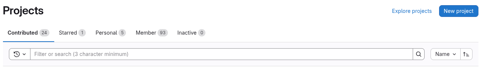
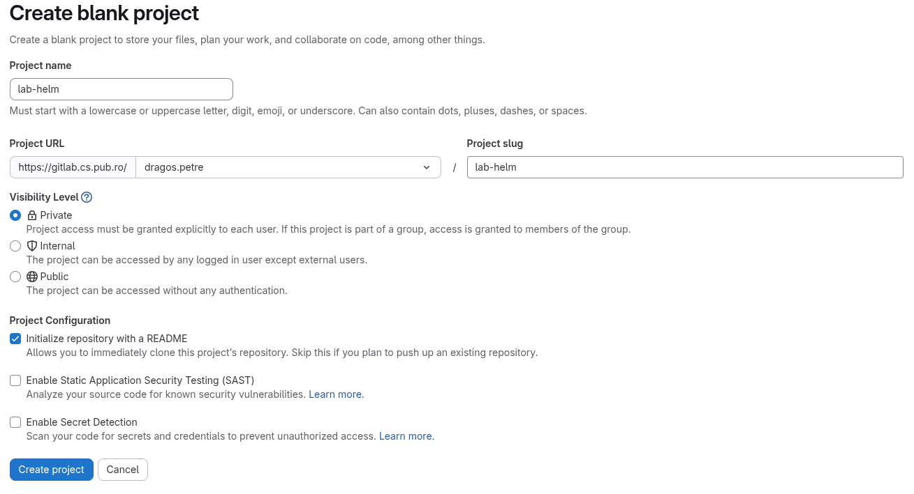
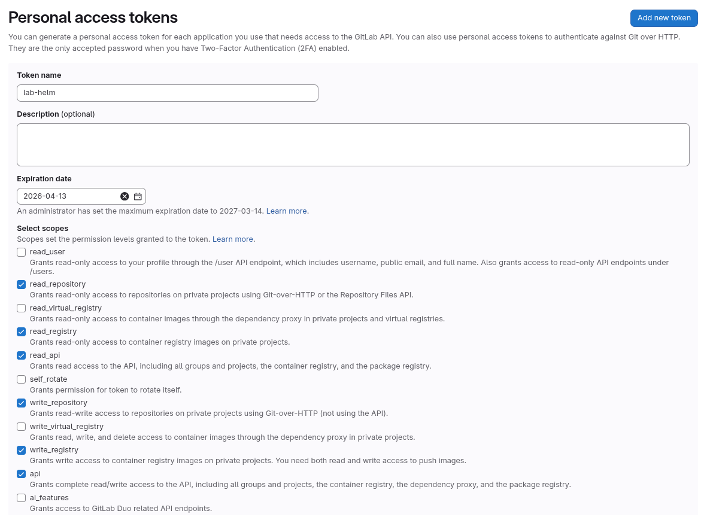
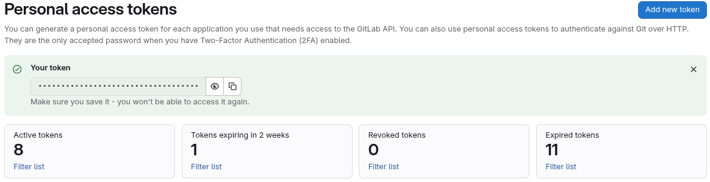
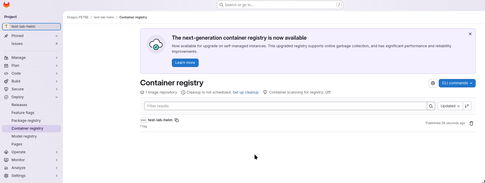
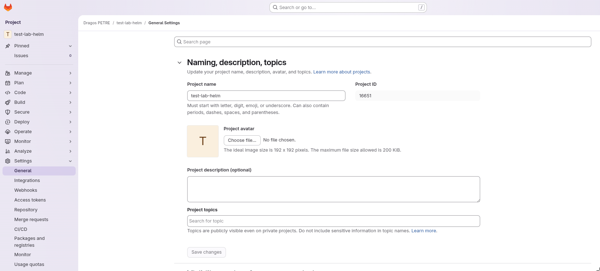
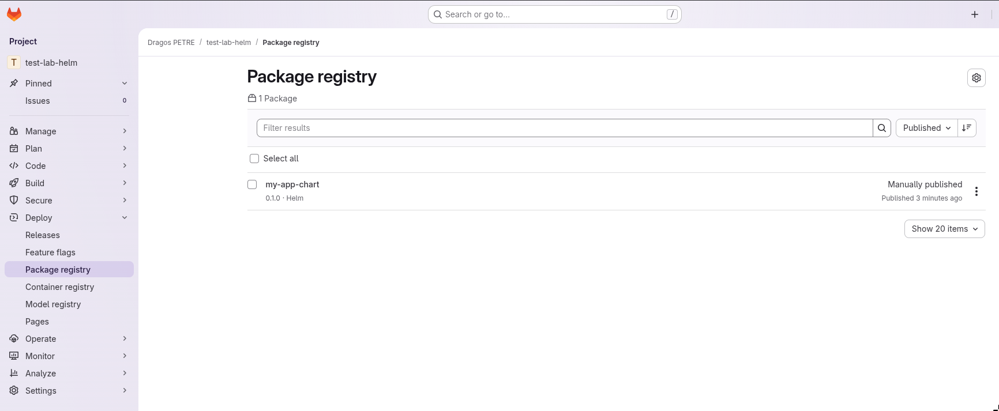

### Helm Chart Packaging

We are now familiar with the way charts work and how to compose and deploy them.
We will now move towards a more practical use case of Helm Charts, and that is creating custom charts and publishing them on private or public repositories to have them accessible for application deployments:

1. To start, we will create a new project on our [Gitlab](https://gitlab.cs.pub.ro/).
Once logged in, go to the [projects tab](https://gitlab.cs.pub.ro/dashboard/projects) and create a new project.
Click the `New Project` blue button on the upper right side of the screen and select `Create blank project` from the opened menu.



2. Give the project a suggestive name in the `Project name` field, and in the `Project URL` press on the drop-down menu, scroll to the `Users` section and select your username from there.
You can leave all the other checkboxes as they are.
Once done, you will see the new project created.



3. Now that we are done with creating the project, the next step is to create an *Access Token* for our account.
If you already have one created, you can skip to the next part.
To create an Access Token, we will go on our [profile to the Personal access token section](https://gitlab.cs.pub.ro/-/user_settings/personal_access_tokens).
Here we will click on the `Add new token` blue button on the upper-right side of the screen.
This will open the token creation menu.
From here we will give our token a name, we will modify the expiration date if we want to use it for a longer time (the default expiration date is one month).
On the `Select scopes` section we will check the boxes for `read_repository`, `read_registry`, `read_api`, `write_repository`, `write_registry`, and `api`.



4. Once these have been selected, press the `Create token` button.
This action will lead to a green box appearing and displaying the newly generated token.
Copy the token and save it on your computer, it will be needed later.



Now that we have everything configured at this points, lets move on.

#### Creating an Application

The first step is to clone the newly created repository. Use `git clone` to clone it on VM and `cd` into it.

The second step is to create an application, containerize it, and publish it on the [Container registry](https://gitlab.cs.pub.ro/dragos.petre/test-lab-helm/container_registry).
The application we will create will be a Python [Flask](https://flask.palletsprojects.com/en/stable/) application serving as a web server with a simple endpoint that will print a message.
To install Flask run:

```bash
pip install Flask
```

We will start with a very simple `Hello, World!` example.
Create in the cloned project a new file named `app.py` (this is a default name for a Flask application to ease its running, not requiring passing additional parameters when starting.
We aim to containerize the application so that we can deploy it inside a Kubernetes cluster.
To do this, we will use `Docker`.
But first, we need to create the Flask application so that it enables external access from outside the container.
The new application will look like this:

```python
from flask import Flask

app = Flask(__name__)

@app.route("/")
def hello_world():
    return "<p>Hello, World!</p>"

if __name__ == "__main__":
    app.run(host="0.0.0.0", port=5000)
```

Now lets create a new file called `Dockerfile` in the root of the cloned repository.
This file will help us build the Docker container for our application.

```Dockerfile
# Use official Python image
FROM python:3.12-slim

# Set working directory
WORKDIR /app

# Copy requirements first (better layer caching)
COPY requirements.txt .

# Install dependencies
RUN pip install --no-cache-dir -r requirements.txt

# Copy application code
COPY app.py .

# Expose Flask port
EXPOSE 5000

# Set environment variables
ENV FLASK_APP=app.py
ENV FLASK_RUN_HOST=0.0.0.0

# Run the application
CMD ["flask", "run"]
```

And lastly, lets create a `requirements.txt` file to specify what dependencies need to be installed in our container.
Add in the `requirements.txt` file the following line.

```txt
flask==3.0.0
```

Once all these are done, our project should look like this:

```shell-session
student@lab-helm:~/cloned/repo$ tree .
./
├── app.py
├── requirements.txt
├── Dockerfile
└── README.md
```

The next step is to build our Docker container.
To do that, we will use the `docker build` command like this:

```shell-session
student@lab-helm:~/cloned/repo$ docker build -t my-flask-hello:latest .
```

Passing the `-t` argument to the `docker build` command will name and tag the resulting image, making it easier for us to identify and deploy it.
After the build process finishes, we can test our newly generate image.
To test it, we will user `docker run` to launch a container that will run our image.

```shell-session
student@lab-helm:~/cloned/repo$ docker run -p 5000:5000 my-flask-hello:latest
```

We passed `-p 5000:5000` to bind port `5000` on our local machine to port `5000` of the docker container.
If you look back in the python code of our application and in the Dockerfile, you will notice that the application is told to run on port `5000` and the same port is exposed by the Dockerfile.

Once the docker container starts running, we can use `curl` to test the connection to our application.

```shell-session
student@lab-helm:~/cloned/repo$ curl http://localhost:5000
[...]
Hello, World!
```

Now that we confirmed that the application is running, we have to push the docker image to our container registry.
To do this, we first have to name and tag our image correctly.
We can follow the details given by Gitlab:

```shell-session
student@lab-helm:~/cloned/repo$ docker build -t gitlab.cs.pub.ro:5050/<username>/<repository-name> .
```

Now lets do a `docker login` to the Gitlab registry.
We will use our Gitlab username and for password we will the Access Token we have generated previously.

```shell-session
student@lab-helm:~/cloned/repo$ docker login gitlab.cs.pub.ro:5050 -u <username>
Password:
```

Once done, we will use the `docker push` command to publish our container.

```shell-session
student@lab-helm:~/cloned/repo$ docker push gitlab.cs.pub.ro:5050/<username>/<repository-name>
```

Once the image has been published, we can go to the Container Registry to check if it appears.



#### Chart Creation and Packaging

Now that we have our containerized application created and published in out Container Registry, we can move on to create the Helm chart.
We will create the chart using the `helm create` command.

```shell-session
student@lab-helm:~/cloned/repo$ helm create my-app-chart
```

This command will generate a Helm chart template for our application.
To ease our deployment, we will delete most of the files that are `my-app-chart/templates` (do not forget to remove the **tests/** directory as well) and keep only the following:

```shell-session
templates/
├── deployment.yaml
├── service.yaml
└── _helpers.tpl
```

Now lets configure out Helm chart.
We will start by defining the default values for our chart.
We will do this by defining parameters and their values in the **values.yaml** file from the root of our chart.
You can replace the content of `values.yaml` with the following one:

```yaml
replicaCount: 1

image:
  repository: gitlab.cs.pub.ro:5050/<username>/<repository-name>
  pullPolicy: Always
  tag: latest

service:
  type: ClusterIP
  port: 5000

containerPort: 5000

imagePullSecrets: [{ name: gitlab-secret }]

secretName: gitlab-secret

dockerConfigJsonEncoded:
```

Now lets modify our deployment in **templates/deployment.yaml**.
You can use the following deployment:

```yaml
apiVersion: apps/v1
kind: Deployment
metadata:
  name: {{ include "my-app-chart.fullname" . }}
  labels:
    {{- include "my-app-chart.labels" . | nindent 4 }}
spec:
  replicas: {{ .Values.replicaCount }}
  selector:
    matchLabels:
      {{- include "my-app-chart.selectorLabels" . | nindent 6 }}
  template:
    metadata:
      labels:
        {{- include "my-app-chart.labels" . | nindent 8 }}
    spec:
      {{- with .Values.imagePullSecrets }}
      imagePullSecrets:
        {{- toYaml . | nindent 8 }}
      {{- end }}
      containers:
        - name: {{ .Chart.Name }}
          image: "{{ .Values.image.repository }}:{{ .Values.image.tag | default .Chart.AppVersion }}"
          imagePullPolicy: {{ .Values.image.pullPolicy }}
          ports:
            - name: http
              containerPort: {{ .Values.service.port }}
              protocol: TCP
```

To enable pulling images from our registry, we need to configure a Kubernetes secrete that enables authentication to the registry.
We will create in the `templates` folder a file named `secret.yaml`:

```yaml
apiVersion: v1
kind: Secret
metadata:
  name: {{ .Values.secretName }}
data:
  .dockerconfigjson: {{ .Values.dockerConfigJsonEncoded }}
type: kubernetes.io/dockerconfigjson
```

Now we have to extract the docker configuration that contains our login to the registry and encode it in **base64**:

```shell-session
cat ~/.docker/config.json | base64 -w 0
```

Copy the result to the `values.yaml` files, as a value for the **dockerConfigJsonEncoded** variable.

Now lets update the service for our deployment.
We will update the **templates/service.yaml** file:

```yaml
apiVersion: v1
kind: Service
metadata:
  name: {{ include "my-app-chart.fullname" . }}
  labels:
    {{- include "my-app-chart.labels" . | nindent 4 }}
spec:
  type: {{ .Values.service.type }}
  ports:
    - port: {{ .Values.service.port }}
      targetPort: http
      protocol: TCP
      name: http
  selector:
    {{- include "my-app-chart.selectorLabels" . | nindent 4 }}
```

Now we have our chart finalized.
We can validate it and render it so that we can see if everything is in place:

```shell-session
student@lab-helm:~/cloned/repo$ helm lint my-app-chart
student@lab-helm:~/cloned/repo$ helm template my-app ./my-app-chart
```

If everything is in place, we can move on to the next step: **packaging**.
Helm chart packaging is done using the `helm package` command.
It is a pretty straight forward process that creates a `.tgz` archive.
Helm charts are packaged as `.tgz` archives, and this is what we will publish to our Package Registry.

```shell-session
student@lab-helm:~/cloned/repo$ helm package my-app-chart
```

This will results in the creation of a file called: **my-app-chart-0.1.0.tgz**.
Now we will publish the chart.
To do this, the first step is to get the **PROJECT ID** for our Gitlab project.
We can find it in the project's settings, in the **General** tab, under *Naming, description, topics*.



To publish the chart, we will use the Gitlab API.
The endpoint to our registry is the following: `https://gitlab.cs.pub.ro/api/v4/projects/<PROJECT_ID>/packages/helm/api/stable/charts`.
We will use the `curl` command to publish the chart:

```shell-session
student@lab-helm:~/cloned/repo$ curl --request POST \
  --user <username>:<token> \
  --form "chart=@my-app-chart-0.1.0.tgz" \
  "https://gitlab.cs.pub.ro/api/v4/projects/<PROJECT_ID>/packages/helm/api/stable/charts"
```

Once the upload is finished, we can check the Package Registry on our Gitlab project to see that the chart was successfully published.



#### Deploying the Chart

Now that we have a chart that it is published, we can try to deploy it on our machine.
We will start by adding the Gitlab registry to the known Helm sources so that we can pull from it.
We will use the `helm repo add` command:

```shell-session
student@lab-helm:~/cloned/repo$ helm repo add gitlab \
  --username <username> \
  --password <token> \
  https://gitlab.cs.pub.ro/api/v4/projects/<PROJECT_ID>/packages/helm/stable
```

And we will do a `helm repo update` to update the sources:

```shell-session
student@lab-helm:~/cloned/repo$ helm repo update
```

Now we can deploy our chart.

```shell-session
student@lab-helm:~/cloned/repo$ helm install my-app gitlab/my-app-chart
```

Now you can check the pods inside the cluster and see if they are running.

Lastly, lets try to connect to our application.
We will start by doing port-forwarding between localhost and the pod/service that is running our application.

```shell-session
student@lab-helm:~/cloned/repo$ kubectl port-forward svc/my-app-my-chart 8080:5000 &
student@lab-helm:~/cloned/repo$ curl https://localhost:8080
```

