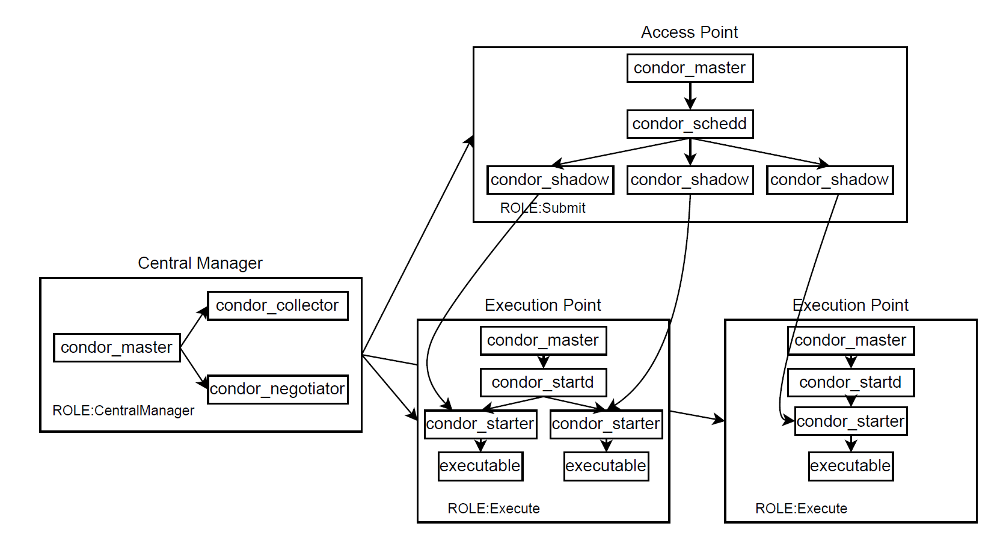

## Need of Job scheduling

Cluster and Grid infrastructures allow users to send execution jobs
(or batches of jobs) that require many computing resources to finish their execution.
Usually, these jobs take many hours to complete and are not suitable for running
on a personal computer.


The following figure shows a typical architecture of a batch queue system that has
three main actors:
   - the users that submit the jobs
   - the worker nodes that execute the tasks submitted by the users
   - a management system that acts as the middleware between the users and the
worker nodes.

In this architecture, a user sends a file written in a special language
(job description language) that is specific to each batch queue solution to the
Management system. The file contains the necessary information needed by the
scheduling algorithms:
   - the name of the executable
   - input files (if any)
   - arguments (if any)
   - the resources needed for execution (CPU cores, RAM, disk, GPU)
   - other scheduling constraints (target architecture, target operating system,
isolation requirements, maximum idle time, priority, price etc.).



## HTCondor

[HTCondor](https://htcondor.org/index.html) is a middleware solution that can
be used for cluster, Grid or cloud architectures. When used in a cluster environment,
it has the functionality of a local job batch system.
Different dedicated-Grid middleware solutions such as PanDa (the middleware
solution used by the CERN's ATLAS project) or GlideinWMS (used by CERN's CMS
project) are based on HTCondor.

HTCondor can work with both Linux and Windows clients and offers many features
such as reliability, scalability or security. The user can specify, through the
job defined language that is used by HTCondor different requirements,
from memory, CPUs, GPUs or disk to the desired architecture and operating system.
Through its agents, HTCondor detects if a worker node becomes unavailable and
can restart the job on another worker node, all this without the user's interaction.


[HTCondor](https://htcondor.readthedocs.io/en/latest/admin-manual/index.html)
has many services that are deployed in the cluster environment.
All the services are spawned from one main process, named `condor_master`.

HTCondor can have many nodes, each node having at least one of the following roles:
    - Central Manager - node that orchestrates the work within the cluster.
It has two main daemon processes (services):
        - `condor_collector` that communicates with all cluster nodes and collects
        information regarding their status and resources
        - `condor_negotiator` that facilitates the scheduling process by mediating
        the available resources (on the worker nodes) with the job requirements (on the Submitter node).
    - Access Point - node that contains the job queue. The main process, also spawned from `condor_master` is `condor_schedd`.
    - Execution Point - worker node that executes all the jobs.  The main process,
    also spawned from `condor_master` is `condor_startd`.


## Deploy minicondor

This section shows how an all-in-one HTCondor architecture (one node that has
all three roles) can be deployed using the `minicondor` Docker image that HTCondor
made available for its users.

:::note
`minicondor` is just for playground. A real cluster or Grid infrastructure that
uses HTCondor should have all services deployed and configured on different nodes.
:::

The first thing we have to do is to pull the Docker image and start the container
using the `docker run` command.

```shell-session
$ docker run -d gitlab.cs.pub.ro:5050/scgc/cloud-courses/htcondor/mini:latest
```


## Inspect the minicondor instance

From another terminal, we can connect to the Docker container and inspect its
content. Using `docker ps`, we can get the container ID and connect to it using
`docker exec` to open a shell in the container environment.

Then, we can run the `ps` command to look at the processes that are running in
the container.

As seen in the following output, we can observe the HTCondor daemons that are
running under the `condor` user. The `condor_negotiation` and `condor_collector`
processes are used by the Central Manager,  `condor_schedd` by the Access Point,
and `condor_startd` by the Execution Point.

By looking at the parent process id (PPID), we can see that all services are
started by the same parent (`condor_master`). Since we are in an all-in-one environment,
the container has all 3 roles and is running all necessary services.

```shell-session
$ docker ps | grep mini
4305a3536077   htcondor/mini   "/start.sh"  4 minutes ago   Up 4 minutes          8080/tcp

$ docker exec -it 4305a3536077 /bin/bash

[root@4305a3536077 /]# ps -ef
UID          PID    PPID  C STIME TTY          TIME CMD
root           1       0  0 12:27 pts/0    00:00:00 /usr/bin/python3 -s /
condor        18       1  0 12:27 pts/0    00:00:01 /usr/sbin/condor_mast
restd         19       1  0 12:27 pts/0    00:00:00 /usr/bin/python3 /usr
root          34      18  0 12:27 pts/0    00:00:00 condor_procd -A /var/
condor        35      18  0 12:27 ?        00:00:00 condor_shared_port
condor        36      18  0 12:27 ?        00:00:00 condor_collector
condor        37      18  0 12:27 ?        00:00:03 condor_negotiator
condor        38      18  0 12:27 ?        00:00:00 condor_schedd
condor        39      18  1 12:27 ?        00:00:05 condor_startd
root         335       0  2 12:33 pts/1    00:00:00 /bin/bash
root         359     335  0 12:33 pts/1    00:00:00 ps -ef
```

## Modify the HTCondor configuration

Further, we can look at the HTCondor configuration files that are under the
`/etc/condor` directory. In the snippet presented in the following listing,
we can see the `minicondor` configuration file. There, we can see the roles
associated with this host (all three roles), as well as the configurations
added for performance fine-tuning by the HTCondor team that proposed the
`minicondor` Docker image.


```shell-session
[submituser@4305a3536077 job]$ cat /etc/condor/config.d/00-minicondor
[...]
# ---  NODE ROLES  ---

# Every pool needs one Central Manager, some number of Submit nodes and
# as many Execute nodes as you can find. Consult the manual to learn
# about additional roles.

# Use my IP address for the Central Manager
CONDOR_HOST = $(IP_ADDRESS)
use ROLE: CentralManager
use ROLE: Submit
use ROLE: Execute

# --- PERFORMANCE TUNING SETTINGS ---

# Since there is just one server in this pool, we can tune various
# polling intervals to be much more responsive than the system defaults
# (which are tuned for pools with thousands of servers).  This will
# enable jobs to be scheduled faster, and job monitoring to happen more
# frequently.
SCHEDD_INTERVAL = 5
NEGOTIATOR_INTERVAL = 2
NEGOTIATOR_CYCLE_DELAY = 5
STARTER_UPDATE_INTERVAL = 5
SHADOW_QUEUE_UPDATE_INTERVAL = 10
UPDATE_INTERVAL = 5
RUNBENCHMARKS = 0

[...]
```

Starting from this configuration file, modify the configuration by setting
`SCHEDD_INTERVAL` and `STARTER_UPDATE_INTERVAL` to 2 seconds and apply it
using the `condor_reconfig` command.

:::note
In real life infrastructures, the values of `SCHEDD_INTERVAL` and
`STARTER_UPDATE_INTERVAL` should be adjusted based on the expected load. These
two parameters define how often updates are sent between various daemons and
how often jobs are scheduled. Setting these value to very small values (in
seconds) is not feasable since the updates will flood the network.

In our testing infrastructure, we can play with the value and see what happens.
However, in a standalone configuration, the default value for both is 300 seconds
(5 minutes)
:::

HTCondor has many configurations split between multiple files and other
implicit configurations. At some point, it can be cumbersome to read the content
of all the configuration files in order to find where (and if) a specific parameter
is set. The system administrators can use the `condor_config_val` to check,
set or unset the value of a configuration parameter.

In the example below, you can see the option `-dump` that is given to `condor_config_val`
in order to show all the values of the variables. If an argument is given after
the `-dump` keyword, then `condor_config_val` will search all the variable names
that contain the given argument.
`condor_config_val` can be used to persistently modify the value of a variable
(i.e., the changes persist after reboot).

```shell-session
[root@4305a3536077 ~]# condor_config_val -dump | head
# Configuration from machine: 4305a3536077
ABORT_ON_EXCEPTION = false
ACCOUNTANT_DATABASE_FILE = $(SPOOL)/Accountantnew.log
ACCOUNTANT_HOST =
ACCOUNTANT_LOCAL_DOMAIN =
ACCOUNTING_DOMAIN = $(UID_DOMAIN)
ActivityTimer = (time() - EnteredCurrentActivity)
ADD_WINDOWS_FIREWALL_EXCEPTION = $(CondorIsAdmin)
ADSTASH_CHECKPOINT_FILE = $(LOG)/adstash_checkpoint.json
ADSTASH_DEBUG = D_ALWAYS

[root@4305a3536077 ~]# condor_config_val -dump HOST
# Configuration from machine: 4305a3536077

# Parameters with names that match HOST:
ACCOUNTANT_HOST =
ADSTASH_SE_HOST = $(FULL_HOSTNAME):9200
COLLECTOR_HOST = $(CONDOR_HOST)
COLLECTOR_HOST_FOR_NEGOTIATOR = $(FULL_HOSTNAME)
COLLECTOR_HOST_STRING = "$(COLLECTOR_HOST)"
CONDOR_HOST = $(IP_ADDRESS)
[...]
```

Using `condor_config_val` show the values you set in the previous task and
find the directory where `HTCondor` saves the log files for the scheduler.
Using this information, check the log files and see what signal was used by
the `condor_reconfig` command you ran earlier.

## HTC Resource inspection

HTCondor splits the resources in the worker nodes into partitions. Usually, each
slot has only one partition, but advanced configurations can use multiple
partitions. The status of the resources can be checked using the
`condor_status` command. `slot1@<domain>` shows that this Execution point has
only one partition. Adding the `-compact` option to `condor_status`, the system
administrators can check the system resources.

```shell-session
[root@8c4670305de5 /]# condor_status
Name                             OpSys      Arch     State     Activity LoadAv Mem   ActvtyTi

slot1@8c4670305de5               LINUX      X86_64   Unclaimed Idle      0.000 5928  0+00:25:

               Total Owner Claimed Unclaimed Matched Preempting  Drain Backfill BkIdle

  X86_64/LINUX     1     0       0         1       0          0      0        0      0

         Total     1     0       0         1       0          0      0        0      0
[root@8c4670305de5 /]# condor_status -compact

Machine      Platform       Slots Cpus Gpus  TotalGb FreCpu  FreeGb  CpuLoad ST Jobs/Min MaxS

8c4670305de5 x64/AlmaLinux9    0     6    0     5.79      6     5.79    0.00 Ui     0.00 *

               Total Owner Claimed Unclaimed Matched Preempting  Drain Backfill BkIdle

x64/AlmaLinux9     1     0       0         1       0          0      0        0      0

         Total     1     0       0         1       0          0      0        0      0


```

At this moment, we do not have any jobs running in the cluster. When a job is
scheduled for execution, using a dynamic provisioning manner, the partition slot
is split into dynamic slots, and the initial partition advertises to the Central
Manager only the remaining resources.

## Submit jobs to HTCondor

Let's submit jobs in the working environment. Using the following script
(`job.sh`) that shows some messages to standard output, standard error and
sleeps 10 minutes, and the following HTCondor submit file `job.sub` through which
we request 2 cores (`request_cpus`), 1GB of RAM (`request_memory`) and
10MB of disk (`request_disk`), we call `condor_submit` to submit
the jobs. In the HTCondor submit file, we specify the executable file name
(under `executable` entry) and the files that should be used for saving the job's
standard output and standard error content. The `log` entry specifies where
the job's log information should be saved. All submit files should end with
the `queue` entry.

In order to submit jobs, we have to be authenticated under the `submituser` account.

Submit two jobs from the same job configuration file.

```shell-session
[root@4305a3536077 /]# su - submituser
[submituser@4305a3536077 ~]$ mkdir job
[submituser@4305a3536077 ~]$ cd job
# create the two files job.sh and job.sub
[submituser@4305a3536077 job]$ chmod u+x job.sh
[submituser@4305a3536077 job]$ cat job.sh
#!/bin/bash

echo "Hello, World!"
echo "Warning: Test error message" >&2

sleep 600

echo "Bye, World!"

[submituser@4305a3536077 job]$ cat job.sub
executable   = job.sh

output       = job.out
error        = job.err
log          = job.log

request_cpus   = 2
request_memory = 1024M
request_disk   = 10240K

queue

[submituser@4305a3536077 job]$ condor_submit job.sub
Submitting job(s).
1 job(s) submitted to cluster 1.
[submituser@4305a3536077 job]$ condor_submit job.sub
Submitting job(s).
1 job(s) submitted to cluster 2.
```

Let's inspect the partition from the Execution Point. It had 6 CPU cores, 6GB
of RAM and 8GB of storage, that was divided into two slots, each having 2 CPUs,
1GB of RAM and 10MB of storage. The slots will be displayed using the following pattern:
`slot<partition number>_<dynamic partition number>@domain`.

Using `condor_q` we can show the jobs that are in the queue.

```shell-session
[root@4305a3536077 ~]# condor_q

-- Schedd: 4305a3536077 : <172.17.0.2:43117?... @ [...]
OWNER      BATCH_NAME    SUBMITTED   DONE   RUN    IDLE   HOLD  TOTAL JOB_IDS
submituser ID: 1        8/1  13:00      _      _      _      1      1 1.0
submituser ID: 2        8/1  13:01      _      1      _      _      1 2.0

Total for query: 2 jobs; 0 completed, 0 removed, 0 idle, 1 running, 1 held, 0 suspended
Total for all users: 2 jobs; 0 completed, 0 removed, 0 idle, 1 running, 1 held, 0 suspended
```

Using `condor_rm` followed by the cluster number (1 and 2), we can kill the jobs
that are in the queue.

For the next scenario, we start (using the same script, submit file and user) 7 identical jobs.

```shell-session
[root@4305a3536077 ~]# condor_q
[submituser@8c4670305de5 job]$ condor_q


-- Schedd: 8c4670305de5 : <172.17.0.2:9618?... @ 11/22/25 11:18:47
OWNER      BATCH_NAME    SUBMITTED   DONE   RUN    IDLE  TOTAL JOB_IDS
submituser ID: 3       11/22 11:18      _      1      _      1 3.0
submituser ID: 4       11/22 11:18      _      1      _      1 4.0
submituser ID: 5       11/22 11:18      _      1      _      1 5.0
submituser ID: 6       11/22 11:18      _      _      1      1 6.0
submituser ID: 7       11/22 11:18      _      _      1      1 7.0
submituser ID: 8       11/22 11:18      _      _      1      1 8.0
submituser ID: 9       11/22 11:18      _      _      1      1 9.0

Total for query: 7 jobs; 0 completed, 0 removed, 4 idle, 3 running, 0 held, 0 suspended
Total for submituser: 7 jobs; 0 completed, 0 removed, 4 idle, 3 running, 0 held, 0 suspended
Total for all users: 7 jobs; 0 completed, 0 removed, 4 idle, 3 running, 0 held, 0 suspended

submituser@8c4670305de5 job]$ condor_status
Name                             OpSys      Arch     State     Activity LoadAv Mem   ActvtyTi

slot1@8c4670305de5               LINUX      X86_64   Unclaimed Idle      0.000 2856  0+00:38:
slot1_1@8c4670305de5             LINUX      X86_64   Claimed   Busy      0.000 1024  0+00:00:
slot1_2@8c4670305de5             LINUX      X86_64   Claimed   Busy      0.000 1024  0+00:00:
slot1_3@8c4670305de5             LINUX      X86_64   Claimed   Busy      0.000 1024  0+00:00:

               Total Owner Claimed Unclaimed Matched Preempting  Drain Backfill BkIdle

  X86_64/LINUX     4     0       3         1       0          0      0        0      0

         Total     4     0       3         1       0          0      0        0      0


```

Use `condor_status` to can check the dynamically created slots. Why there are
only 3 dynamically created slots and only 3 jobs running?

:::note
Each of the 7 jobs we have submitted requested 2 CPUs and 1GB of RAM.

The system has 6CPUs, 6GB of RAM and 8GB of disk.

Based on this configuration and the job requirements,
HTCondor can only split the slot into 3 dynamic slots, each having 2CPUs and 1 GB
of RAM and 10MB of disk. You can see this using the following `condor_status`
command.

```shell-session
condor_status -autoformat:hr  Name OpSys Arch State Activity Memory Disk CPUs
Name                   OpSys   Arch     State       Activity Memory Disk    CPUs
"slot1@8c4670305de5"   "LINUX" "X86_64" "Unclaimed" "Idle"   2856   3651400 0
"slot1_1@8c4670305de5" "LINUX" "X86_64" "Claimed"   "Busy"   1024   11264   2
"slot1_2@8c4670305de5" "LINUX" "X86_64" "Claimed"   "Busy"   1024   11264   2
"slot1_3@8c4670305de5" "LINUX" "X86_64" "Claimed"   "Busy"   1024   11264   2

```
:::

Using `pstree` we can look at the tree of processes that are running in the container.
We can see that there are 3 `condor_shadow` processes started by  `condor_schedd`
(Access Point) and 3 corresponding `condor_starter` processes spawned from
`condor_startd` (Execution Point).

:::note
You can install `pstree` using `dnf install psmisc`
:::


```shell-session
[root@4305a3536077 /]# pstree -A -c
supervisord-+-condor_master-+-condor_collecto
            |               |-condor_negotiat
            |               |-condor_procd
            |               |-condor_schedd-+-condor_shadow
            |               |               |-condor_shadow
            |               |               `-condor_shadow
            |               |-condor_shared_p
            |               `-condor_startd-+-condor_starter---job.sh---sleep
            |                               |-condor_starter---job.sh---sleep
            |                               `-condor_starter---job.sh---sleep

```

Next, we can check the content of the output files that we configured in the
HTCondor submit file. First, we look at the standard error and standard output
files. Since all jobs are running from the same directory and are writing in the
same files, the content is overwritten.

```shell-session
[submituser@4305a3536077 job]$ cat job.err
Warning: Test error message
[submituser@4305a3536077 job]$ cat job.out
Hello, World!
```

Then, we can check the content of the log file. From it, we can see that each
job has a scratch directory under `/var/lib/condor/execute/`. This directory is
used if job input files should be brought from a shared storage. Also, the log
file shows information about each slot in terms of used resources.

```shell-session
[submituser@4305a3536077 job]$ cat job.log
000 (003.000.000) 2025-08-01 13:06:50 Job submitted from host: <172.17.0.2:9618?addrs=172.17.0.2-9618&alias=4305a3536077&noUDP&sock=schedd_18_eccb>
...
[...]
        SlotName: slot1_1@4305a3536077
        CondorScratchDir = "/var/lib/condor/execute/dir_1554"
        Cpus = 2
        Disk = 11264
        GPUs = 0
        Memory = 1024
[...]
[submituser@4305a3536077 job]$ ls -l /var/lib/condor/execute/
total 0
drwx------. 2 submituser submituser 79 Aug  1 13:09 dir_1554
[...]
```
Inspect the content of a `dir_<no>` directory. Look at the content of the following
files:
  - `.job.ad` - [Job ClassAd](https://htcondor.readthedocs.io/en/lts/classad-attributes/job-classad-attributes.html),
    job characteristics and constraints such as the command that was executed,
    arguments, requirements or the submit file.
  - `.machine.ad` - [Machine ClassAd](https://htcondor.readthedocs.io/en/lts/classad-attributes/machine-classad-attributes.html),
    machine characteristics and constraints such as the host IP address, operating
    system or CPU characteristics (model, flags etc.).

:::note
In this setup, we use the files (e.g., the executable) from the local storage.
However, in a real cluster/Grid environment, the job's related files (executable,
input files) will not be, usually, on the same storage as the execute node.
In this case, HTCondor will download the files locally from a remote storage
in this directory before staring the executable.

In debug sessions during job's execution, one usually looks at this directory
to check what the job produces.
:::

HTCondor also has accounting mechanisms and a priority-based scheduler.
Using the `condor_userprio` command, we can see the priorities for the `submituser` user.
The shown values are automatically updated based on the active users and the
tasks running in the cluster (in order to avoid job starvation situations).
In terms of the value of the priority, a lower value has greater priority.

```shell-session
[submituser@4305a3536077 job]$ condor_userprio
Last Priority Update:  8/1  13:14
                         Effective   Priority  Wghted Total Usage  Time Since Submitter Submitter
User Name                 Priority    Factor   In Use (wghted-hrs) Last Usage   Floor    Ceiling
----------------------- ------------ --------- ------ ------------ ---------- --------- ---------
submituser@4305a3536077       551.72   1000.00     14         1.91      <now>
----------------------- ------------ --------- ------ ------------ ---------- --------- ---------
Number of users: 1                                 14         1.91    0+23:59
```

## Submit multiple same-type jobs

In the previous example, we have submitted the same job multiple times. The issue
with that approach was that everytime a job would finishes its execution, it will
rewrite the content of the output file.

Using the instructions from [here](https://htcondor.readthedocs.io/en/main/users-manual/quick-start-guide.html#expanding-the-science-job-and-the-organization-of-files),
create a job description file that:
    - submits 15 identical jobs
    - has 2 arguments (of your choice)
    - has a custom `stdout` and `stderr` file for each job
    - request 1 CPU, 512M of RAM and 10MB of storage.

How many dynamically allocated slots will be created?

The script that is executed by each job should:
    - print the current date
    - print the arguments it has received to standard error
    - print a randomly generated string
    - sleep for a random number of seconds between 5 and 200.

Submit the job and:
    - show the jobs
    - show the dynamically created slots
    - show their output file
