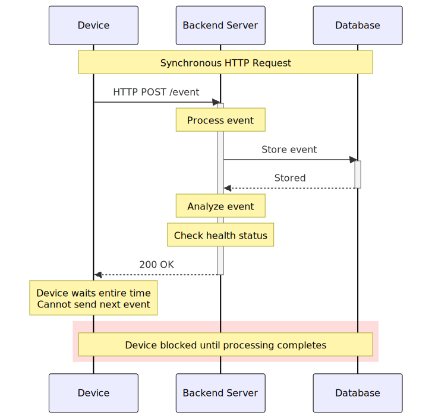
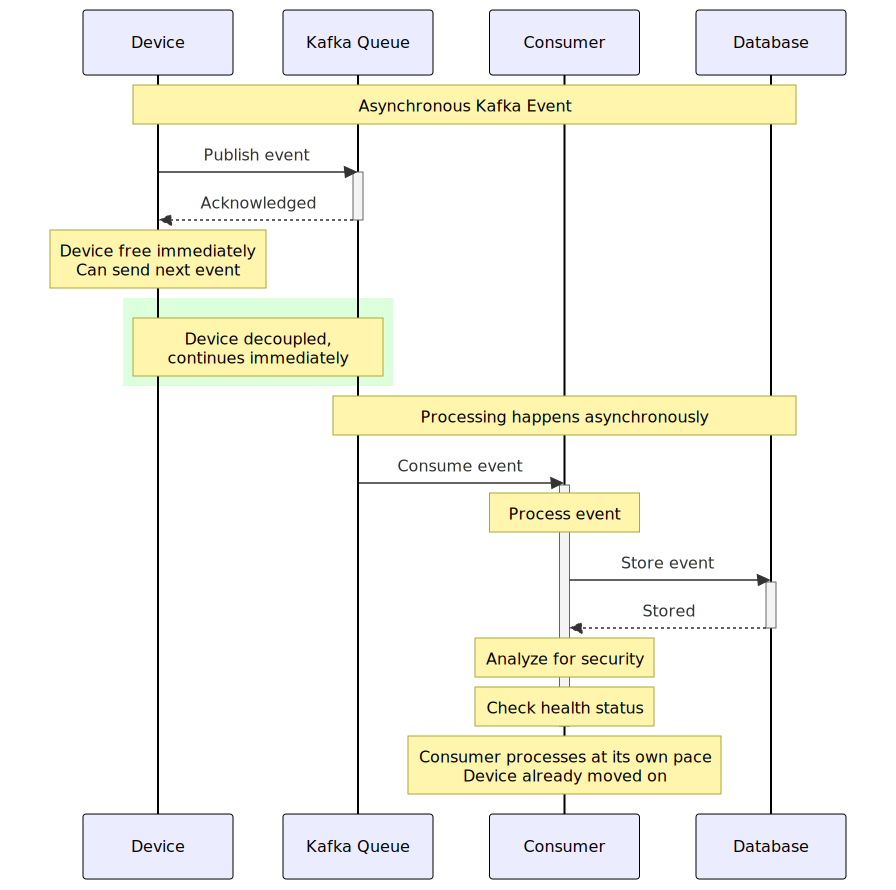

## What is Kafka?

**Apache Kafka** is an open-source distributed event streaming platform used to build real-time data pipelines and streaming applications. Originally developed at LinkedIn and later open-sourced through the Apache Software Foundation, Kafka is designed for high-throughput, low-latency handling of real-time data feeds.

The key features that Kafka provides are:
- **High throughput**: Kafka can handle millions of messages per second
- **Scalability**: Kafka clusters can scale horizontally by adding more brokers and partitions
- **Durability**: Data is persisted on disk and replicated across multiple brokers for fault tolerance

We will explain each keyword in the following chapters.

## Why do we need Kafka?

**Kafka** is used extensively across industries and domains that require real-time data streaming, reliable data pipelines and scalable system architectures.

Here is a list of companies that use Kafka in their tech stack:
1. Netflix
    * monitors streaming quality and buffer times
    * delivers recommendations based on recent watch history
    * trigger adaptive bitrate switching based on network conditions
2. Riot Games (League of Legends)
    * track millions of in-game events per second
    * analyze performance, gameplay balance and user engagement
    * push live updates without interrupting gameplay
3. Uber
    * tracks driver location for live updates
    * updates trip status (driver on the way, trip completed)
    * ETA calculations, route updates and dynamic pricing (surge)
4. Adobe
    * part of the Pipeline solution in Adobe Experience Platform
    * processes hundreds of billions of messages each day
    * replicates messages across 15 different data centers in AWS, Azure, and on-prem

### Example: Using Kafka for Device Monitoring

Consider a device monitoring solution similar in purpose to Prometheus that collects events such as CPU and RAM usage or file modifications. For large organizations, this can generate millions of events per day that require backend processing for security analysis, health monitoring, alerting, or other purposes.

#### Limitations of Synchronous Processing

A synchronous solution using HTTP calls has fundamental scalability constraints. The backend must process each event before accepting the next one, with parallelism limited by the number of available connections. This creates two problems:

- **Event loss**: If the backend cannot process events quickly enough, incoming events may be dropped or timeout
- **Tight coupling**: Monitored endpoints depend directly on backend availability and response time

#### How Kafka Addresses These Issues

Kafka provides a message queue that enables asynchronous event processing:

- **Decoupling**: Endpoints publish events to Kafka and continue immediately, independent of backend processing speed or availability.
- **Asynchronous consumption**: The backend reads and processes events from the queue at its own pace, based on available resources.
- **Buffering**: Events are stored in the queue until processed, preventing loss during traffic spikes or temporary backend unavailability.
- **Horizontal scalability**: Multiple backend consumers can process events in parallel, and additional consumers can be added as load increases.

This architecture separates event production from consumption, allowing each component to scale independently and ensuring reliable event processing even under high load.

#### Asynchronous Requests: Trade-offs and Considerations

Asynchronous request processing offers significant advantages for system scalability and resilience. By decoupling the sender from the receiver, asynchronous systems allow components to operate independently—senders can continue their work without waiting for processing to complete, and receivers can process requests at their own pace based on available resources. This prevents cascading failures, as a slow or unavailable downstream service does not block upstream components. Additionally, asynchronous processing enables better resource utilization through load leveling, where spikes in traffic are absorbed by queues and processed during quieter periods. However, asynchronous architectures introduce complexity and trade-offs. The most significant is **increased latency**: the sender does not receive immediate confirmation that their request was successfully processed, only that it was queued. This complicates **error handling**—failures may occur long after the request was sent, requiring separate mechanisms for monitoring and retry logic. **Ordering guarantees** become harder to maintain, as requests may be processed out of sequence unless explicitly managed. Finally, asynchronous systems require additional infrastructure (message queues, worker pools) and **operational complexity** for monitoring queue depths, handling dead-letter queues, and ensuring messages are not lost or duplicated.
