## Exercises

From this point, we will use the python script provided in the lab archive.

:::info
To continue the lab, we need to create a virtual environment (`venv`) and install the `confluent-kafka` package. Run the following commands directly on the VM, **not** in the kafka container:

```shell-session
student@lab-kafka:~$ python3.10 -m venv venv
student@lab-kafka:~$ source venv/bin/activate
(venv) student@lab-kafka:~$ pip3 install confluent-kafka
```
:::

:::warning
Make sure your prompt contains the `(venv)` message, as the following example:
```shell-session
(venv) student@cc-lab:~$
```
The `confluent-kafka` package is available only in the virtual environment, not on the machine.
:::

For more in-depth details about `confluent-kafka`, [check the official documentation](https://docs.confluent.io/platform/current/clients/confluent-kafka-python/html/index.html).

### Task 1

Here we have a **Python** script that creates multiple threads, one for each consumer/producer. We will always have one producer, which creates an event per second without any output, until the SIGINT (CTRL + C) signal is caught. We have a variable number of consumer threads, which will print everytime they consume something. Example of output:

```shell-session
$ python3 kafka.py
Consumer 0: {"to": "Steve Jobs", "from": "KFYbPZO@gmail.com", "message": "We will have affordable prices, right?"} (key: None)
SIGINT received. Stopping thread...
```

Follow `TODO1` comments and let some events to be produced. What is the result in each consumer?

<details>
<summary><b>Read me after</b></summary>

Each consumer will get all the events. Sometimes this is what we want, but sometimes this behaviour can lead to duplicating the actions.
An example is the online shop that send events each time an user purchases something. One email service would want to subscribe to these events to send details to customers. Another service, that generates invoices for businesses, would also be a consumer. Both require the same events, not just a subset of them.

What about a high traffic day that require two invoice services to generate the documentation in time? It would be a disaster to generate and send two invoices for one purchase, right?
</details>

### Task 2

Follow `TODO2` comments and let some events to be produced. What is the result in each consumer?

<details>
<summary><b>Read me after</b></summary>

As we can see, grouping multiple consumers under the same ID means that we will not consume the same event twice.

**Kafka** has an internal routing system based on partitions and the number of consumers in a consumer group. In this case, we can have maximum 5 active consumers because we have 5 partitions. The rest of the consumers will be on hold and will run only if active consumers stop for any reason.
</details>

### Task 3

Follow `TODO3` comments and let some events to be produced. What is the result in each consumer?

<details>
<summary><b>Read me after</b></summary>

Up until this moment, we sent events that had a value, but without a key.
When we send an event with a key, **Kafka** makes a hash of the key and assigns it to a partition. From that moment, all the events containing that key hash will be routed to the same partition.

You can also check the `kafka-ui` dashboard.

:::note
We are creating a small amount of events compared to what Kafka can handle. There is a chance that some consumers will not get events.

Kafka **does not guarantee** that events with different keys will be sent on different partitions.

Kafka **guarantees** that events with the same key will also get on the same partition.
:::
</details>

### Task 4

The setup in `bad-guys/` simulates a common production setup, with an API producing events for a consumer to process. For this exercise to
run, the initial Docker compose must also be up.

#### Architecture



| Container   | Role               | Port  |
|-------------|--------------------|-------|
| `api`       | Flask REST API / Kafka **producer** | 5000  |
| `processor` | Kafka **consumer** / result writer  | N/A   |
| `kafka`     | Kafka broker (external compose)     | 9092  |

Both containers share a single **SQLite** database via a named Docker volume (`db_data`), mounted at `/data/bad-guy.db`. In
a production setup, this would be a Postgres, OpenSearch or other database accessed via the network.

#### Quick Start

To start the API and processor, build and start the `bad-guys` containers:

```shell-session
student@lab-kafka:~/bad-guys$ docker compose up --build
```

The `kafka-init` one-shot container will create the `bad-guy-requests` topic automatically.

---

#### API Reference

##### POST `/bad-guys` – Submit a new request

**Request body**
```json
{
  "story": "In a galaxy far, far away…",
  "characters": ["Darth Vader", "Luke Skywalker", "Yoda"]
}
```

**Response `202 Accepted`**
```json
{
  "request_id": "550e8400-e29b-41d4-a716-446655440000",
  "status": "in_progress"
}
```

---

##### GET `/bad-guys?request_id=<uuid>` – Poll for results

**Response `200 OK` (while processing)**
```json
{
  "request_id": "550e8400-e29b-41d4-a716-446655440000",
  "story": "In a galaxy far, far away…",
  "characters": ["Darth Vader", "Luke Skywalker", "Yoda"],
  "status": "in_progress",
  "created_at": "2024-01-01 12:00:00",
  "updated_at": "2024-01-01 12:00:00"
}
```

**Response `200 OK` (when done)**
```json
{
  "request_id": "550e8400-e29b-41d4-a716-446655440000",
  "story": "In a galaxy far, far away…",
  "characters": ["Darth Vader", "Luke Skywalker", "Yoda"],
  "status": "done",
  "created_at": "2024-01-01 12:00:00",
  "updated_at": "2024-01-01 12:00:07",
  "bad_guys": {
    "Darth Vader":     "ULTIMATE_BAD_GUY",
    "Luke Skywalker":  "NOT_BAD_GUY",
    "Yoda":            "BAD_GUY"
  }
}
```

:::tip
 Interact with the API using `curl [...] | jq` to pretty-print the JSON responses.

For example, to submit a new request:

```shell-session
curl -X POST http://localhost:5000/bad-guys \
  -H "Content-Type: application/json" \
  -d '{"story": "In a galaxy far, far away…", "characters": ["Darth Vader", "Luke Skywalker", "Yoda"]}' | jq
```

or to poll for results:

```shell-session
curl "http://localhost:5000/bad-guys?request_id=550e8400-e29b-41d4-a716-446655440000" | jq
```

:::

#### Subtasks

1. **Observe the async flow** – Inspect the code; POST a request and immediately GET it; notice the `in_progress` status. Poll every second until it flips to `done`. Check the Compose logs to see that requests are processed sequentially and independent of the initial HTTP request.
2. **Scale consumers** – Run multiple `processor` instances. Kafka's consumer group guarantees each message is processed once. To do this, scale up the number of replicas in the compose config of the `processor`.
3. **Inspect Kafka** – Exec into the `kafka` container and use `kafka-console-consumer` to see raw messages on the `bad-guy-requests` topic.
4. **Fault tolerance** – Scale the processor back to 1 container. Kill the container mid-flight. Restart it. What happens to in-flight messages?
