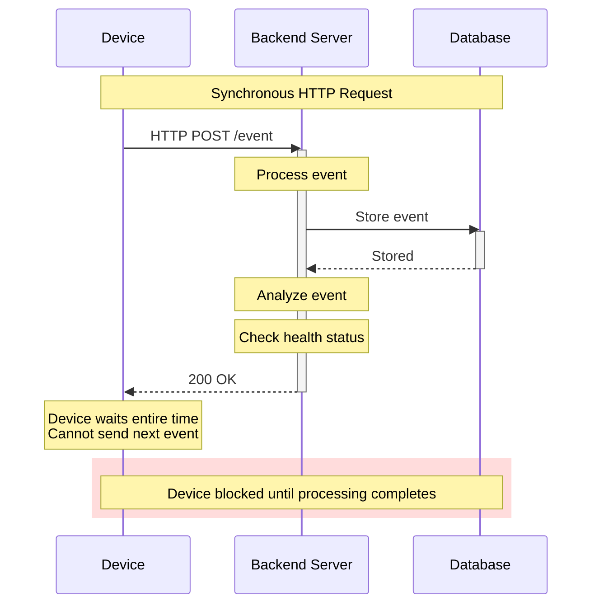
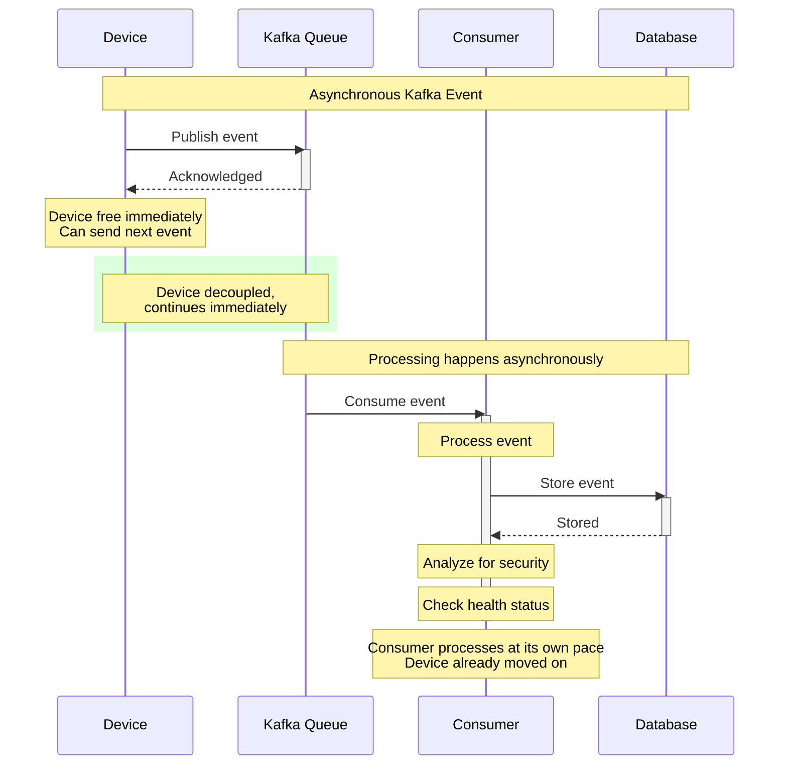
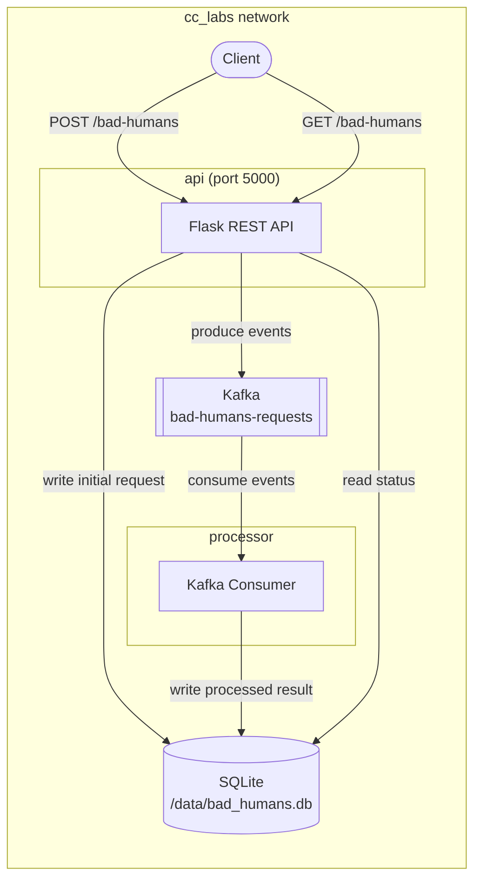

Mermaid code used to generate the diagrams. This should not be directly included anywhere

HTTP sync

```mermaid
sequenceDiagram
    participant D as Device
    participant S as Backend Server
    participant DB as Database
    
    Note over D,DB: Synchronous HTTP Request
    
    D->>S: HTTP POST /event
    activate S
    Note over S: Process event
    S->>DB: Store event
    activate DB
    DB-->>S: Stored
    deactivate DB
    Note over S: Analyze event
    Note over S: Check health status
    S-->>D: 200 OK
    deactivate S
    Note over D: Device waits entire time<br/>Cannot send next event
    
    rect rgb(255, 220, 220)
        Note over D,DB: Device blocked until processing completes
    end
```

Kafka async

```mermaid
sequenceDiagram
    participant D as Device
    participant K as Kafka Queue
    participant C as Consumer
    participant DB as Database
    
    Note over D,DB: Asynchronous Kafka Event
    
    D->>K: Publish event
    activate K
    K-->>D: Acknowledged
    deactivate K
    Note over D: Device free immediately<br/>Can send next event
    
    rect rgb(220, 255, 220)
        Note over D,K: Device decoupled,<br/>continues immediately
    end
    
    Note over K,DB: Processing happens asynchronously
    
    K->>C: Consume event
    activate C
    Note over C: Process event
    C->>DB: Store event
    activate DB
    DB-->>C: Stored
    deactivate DB
    Note over C: Analyze for security
    Note over C: Check health status
    deactivate C
    
    Note over C: Consumer processes at its own pace<br/>Device already moved on
```

Prod-like setup

```mermaid
flowchart LR
    subgraph cc_labs network
        Client(["Client"])

        subgraph api["api (port 5000)"]
            Flask["Flask REST API"]
        end

        Kafka[["Kafka
bad-humans-requests"]]

        subgraph processor["processor"]
            Consumer["Kafka Consumer"]
        end

        SQLite[("SQLite
/data/bad_humans.db")]
    end

    Client -- "POST /bad-humans" --> Flask
    Client -- "GET /bad-humans" --> Flask
    Flask -- "produce events" --> Kafka
    Kafka -- "consume events" --> Consumer
    Flask -- "write initial request" --> SQLite
    Consumer -- "write processed result" --> SQLite
    Flask -- "read status" --> SQLite
```
