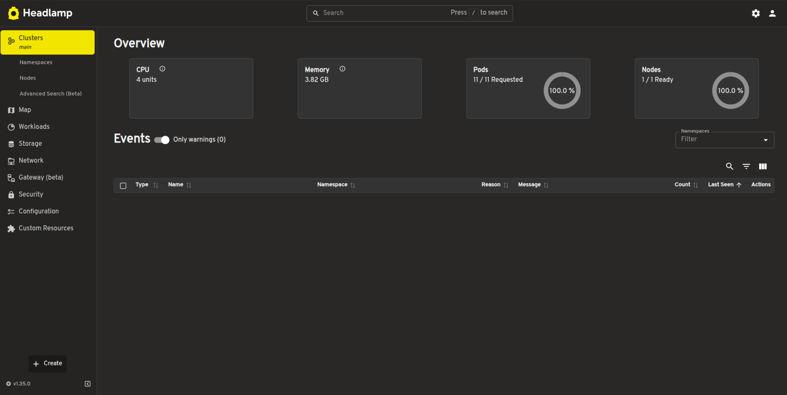
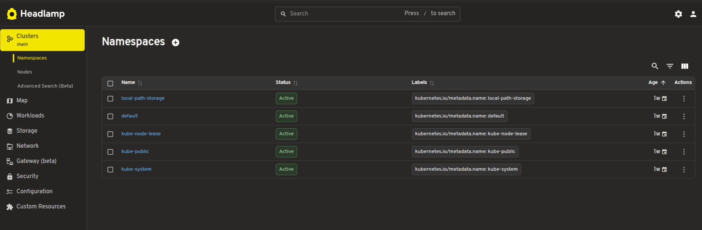
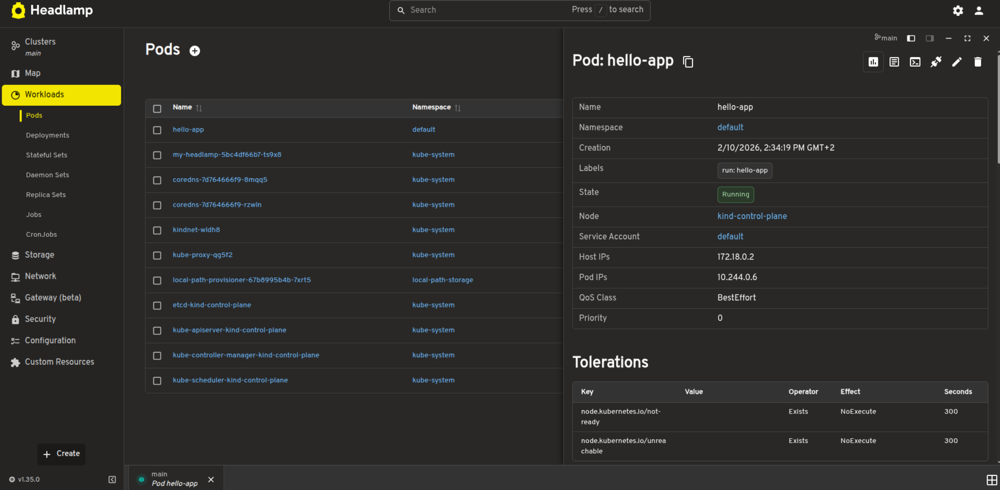

## Kubernetes dashboard - Headlamp

[Headlamp](https://headlamp.dev/) is an user-friendly Kubernetes UI dashboard.

While `kubectl` is the standard tool for interacting with the cluster in a cli-manner, a graphical interface like Headlamp helps you visualize resources and monitor services more easily:



### Headlamp installation

You can use the following helper script to install Headlamp on your machine:

```shell-session
$ wget https://repository.grid.pub.ro/cs/cc/laboratoare/install-headlamp.zip
$ unzip install-headlamp.zip
$ chmod u+x ./install-headlamp.sh
$ ./install-headlamp.sh
```

After the script executed successfully, the output will guide you to connect to the dashboard:

```shell-session
student@cc-lab:~$ ./install-headlamp.sh
Headlamp successfully installed!

Headlamp is running on node 172.18.0.2 at port 30080.

To access the dashboard, run the following command on your **local machine**:
ssh -J fep.grid.pub.ro -L 8080:172.18.0.2:30080 student@10.9.X.Y

Open in your browser: http://localhost:8080

To login in the Headlamp dashboard, get the ID token by running:
kubectl create token my-headlamp --namespace kube-system
```

:::note
You are required to configure a new ssh connection that will forward the dashboard port from the cluster to your local machine:
```shell-session
$ ssh -J fep.grid.pub.ro -L 8080:172.18.0.2:30080 student@10.9.X.Y
```

Afterwards, the dashboard can be accessed using your browser at `http://localhost:8080`.
:::

### Headlamp usage

Now that you have access to the dashboard, let's explore the cluster status and resources visually.

1. Inspect namespaces

Navigate to `Cluster / Namespaces` in the left sidebar.

This view lists all the namespaces currently existing in your cluster. You will see the standard Kubernetes namespaces (like `kube-system`, `kube-public`) alongside the `default` namespace. Throughout the labs, we will be working in the `default` namespace.



:::note
Click on the `default` namespace. This will show a summary of the resource quotas and active resources (like Pods, Deployments, Services) running specifically within `default` namespace. This is equivalent to running `kubectl get all -n default`.
:::

2. Inspect nodes

Navigate to `Cluster / Nodes` in the left sidebar.

Since we are using `kind`, you will see a single node listed, typically named `kind-control-plane`. This node is the control plane of our cluster and also runs the workloads (Pods) that we will be creating in the labs.

3. Inspect pods

Navigate to `Workloads / Pods` in the left sidebar.

This is one of the most useful views for day-to-day operations. It gives you a quick overview of all pods and their status (Green for `Running`, Red for `Error`/`CrashLoopBackOff`).

Click on the `hello-app` pod to see more details about it. You can inspect the logs (equivalent to `kubectl logs hello-app`) or even open a terminal session inside the pod (equivalent to `kubectl exec -it hello-app -- /bin/sh`).


