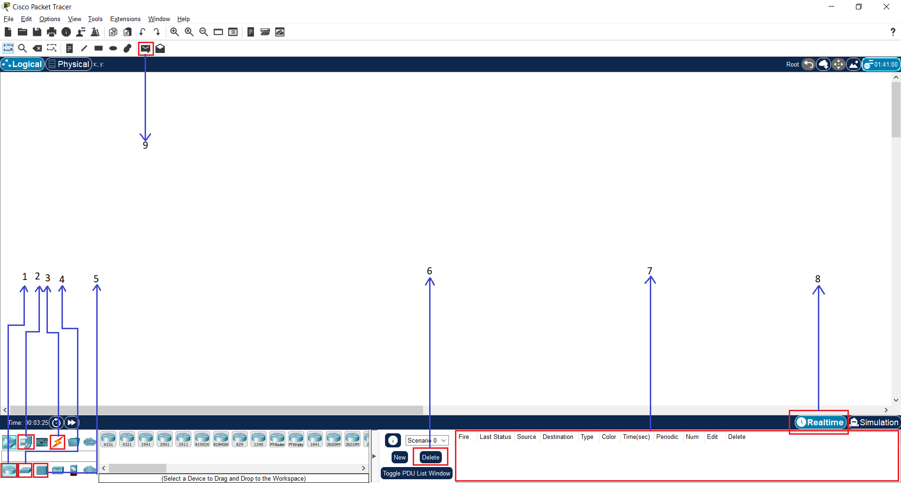

## Setup

Packet Tracer can be downloaded [from here](https://www.netacad.com/resources/lab-downloads?courseLang=en-US). You will need to sign up for an account. You can use your institutional email.

## Packet Tracer intro

 

Packet Tracer is a utility with which you can simulate network topologies using hubs, routers, switches and computers. We will introduce the main components in the workspace:

1. When pressed, several router models will appear to the right of it. Simply choose the Router-PT model and place it in the workspace (white middle part) wherever you want.
2. When pressed, several computer models will appear to the right of it. Simply choose the PC-PT model and place it in the work area (white middle part) wherever you want.
3. Choose the type of connection (UTP straight, UTP cross-over, serial connection, etc.). Simply choose the first cable type (the one labeled Automatically Choose Connection Type, with the orange lightning bolt icon), this automatically sets the connection type between two devices. After selecting the cable type click on the equipment you want to connect. In some cases you will have to choose the port of the equipment (e.g. FastEthernet 0/1, FastEthernet 0/2, etc.).
4. When pressed several switch models will appear to the right of it. Simply choose the Switch-PT model and place it in the work area (white middle part) wherever you want.
5. When pressed several hub models will appear to the right of it. Simply choose the Hub-PT model and place it in the working area (white middle part) wherever you want.
6. You can use the Delete button to delete the history of sent packets.
7. The lower right pane will display the sent packet and the status of the reception (Last Status).
8. You can select the operating mode: Realtime (default mode) or Simulation (click on the tab behind Realtime to activate it). In Simulation mode you can see step by step how the packets flow between the active devices. While in Simulation mode, send a packet and then press the Auto Capture/Play button.
9. You can send a packet between two Layer 3 entities (computer, router). After selecting this function, click on the devices between which you want to send packets.

:::info Connectivity test

* Create a topology with 2 linked switches and 2 computers linked to each of the switches.
* Before packets can be sent, IP addresses must be configured on each of the computers. When you click on a computer, a window will appear where you can configure the computers. Go to the `Desktop` tab and click on the `IP Configuration` icon.
* Fill in the IP Address field with an IP address in the range `192.168.1.1` - `192.168.1.5` and the Subnet Mask field with the value `255.255.255.0`. The rest of the fields remain empty.
* Check connectivity between each 2 computers using facility 9 above.

:::
